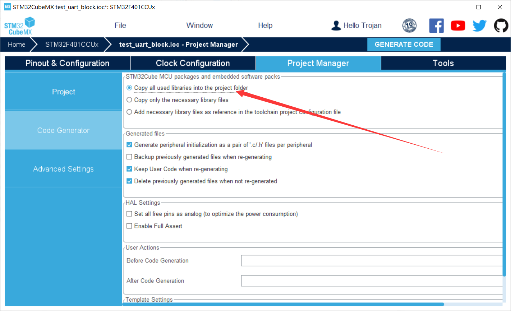
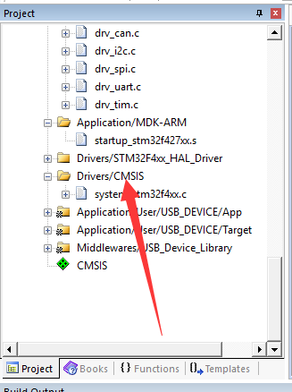
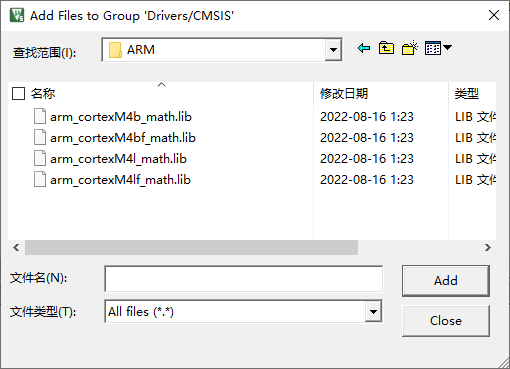
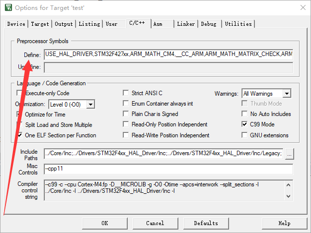
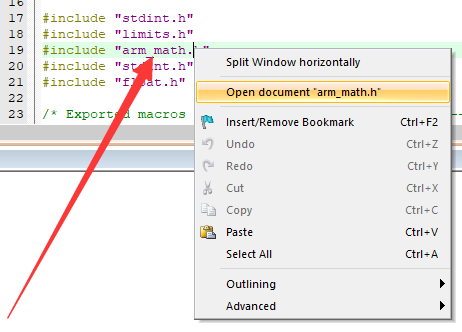

# 快速计算库arm_math.h库的引入

yssickjgd@mail.ustc.edu.cn

## 先说是不是, 再说为什么

​	很多朋友可能思考过这样一个问题, 那就是我们的STM32系列单片机绝大多数的计算频率都是几十几百兆Hz, 远不及我们的PC机的计算速率. 除此之外, 有很多的单片机是没有浮点计算单元 ( Floating Point Unit, FPU ) 的, 这种情况下只能用普通的计算核心来对浮点数进行处理, 因此对浮点数的计算又会慢许多.

​	我们在学C语言时, 应该都了解过**math.h**这个库, 它是C语言的一个库函数, 主要进行一些常见的数学运算处理等功能, 含有很多数学相关的函数. 但它在单片机上运行效率并不是很理想, 需要占用较多时间, 而且绝大多数编译器没有针对该库函数做出比较有效的优化. 那么, 在这种情况下, 如何节省算力, 或者提高运算的速率, 都会变得重要了起来. 

​	**arm_math.h**便是ARM提供的一款适配STM32单片机的运算库, 里面包含了math.h绝大多数的函数与处理算法, 除此之外, 根据用户配置与使用, arm_math,h甚至还可以支持PID算法, 矩阵运算等内容. 另外, CMSIS-DSP库也是需要**arm_math.h**库支持的. 

​	因此, 如果在单片机程序中, 我们使用了较多的复杂数学函数, 如开方, 矩阵运算, 三角函数等, 从运算效率角度上, 本人是极力推荐使用**arm_math.h**库的

## arm_math库引入的具体方法

-   首先, 在已建立的STM32CubeMX的工程配置 ( Project Manager ) 中, 找到代码生成 ( Code Generator ) 选项, 勾选"复制所有使用的库", 这样会让我们的**arm_math.h**库也被生成

    

-   和往常一样, 照常生成代码之后, 打开Keil, 进行进一步的配置. 在这里需要先包含进我们的库文件, 这样才能在后续使用**arm_math.h**库. 我个人比较喜欢在**Drivers/CMSIS**这个文件夹下面加入. 当然对工程文件结构比较熟的同学会知道, 在哪个文件夹下面加都是差不多的

    

    

-   双击进入这个文件夹, 在选择文件界面向上一级到工程文件路径中, 然后进入**Drivers/CMSIS/Lib/ARM**路径, 文件类型选择全部文件 ( All Files ) 

    

-   根据自己的单片机以及程序的大小端情况 ( 对应的缩写是大端big的b, 还是小端little的l ) , 还有是否支持FPU ( 是否带f ) , 决定使用哪个lib文件作为库. 比如, RM中使用的A板和C板, 都是小端的, 而且作为F4系列的单片机是支持FPU的, 因此一般选择第四个lib文件, 也就是**arm_cortexM4lf_math.lib**, 双击即可

    

-   接下来, 则需要在编译选项中添加相关指令, 从而让编译器能按照这个库的方式来进行编译. 点进魔术棒, 选择**C/C++**, 在**Define**中加入如下内容

    ```C
    USE_HAL_DRIVER,STM32F427xx,ARM_MATH_CM4,__CC_ARM,ARM_MATH_MATRIX_CHECK,ARM_MATH_ROUNDING,__FPU_PRESENT=1
    ```

    

    
    每个编译指令需要用半角逗号隔开. 其中, 前两个逗号前的指令是Cube自动生成的, 第三句往后是自己加的. 

    -   第三句**ARM_MATH_CM4**, 表示用CortexM4系列内核, 描述了当前单片机是M4内核的, 用于适配硬件处理器. 如果是F1系列单片机, 则需要改成**ARM_MATH_CM3**
    -   第四句**__CC_ARM**, 是对应ARM RealView开发平台的, 它需结合uvision, eclipse或CodeWarrior等开发环境来使用的. 我们用的是uvision开发平台, 因此需要该宏定义编译指令
    -   第五句**ARM_MATH_MATRIX_CHECK**, 指的是对输入的矩阵检查大小, 防止出现意外错误如数组越界等
    -   第六句**ARM_MATH_ROUNDING**, 主要作用于浮点数转定点数情况下, 用于四舍五入的处理
    -   第七句, 也是最后一句, **__FPU_PRESENT=1**, 用于表示我们使用的该MCU芯片带有浮点处理功能

-   尝试编译, 大概率是没错的, 接下来**include "arm_math.h"**就可以进行使用了. 另外也可以通过右键代码中的**arm_math.h**来查看该文件中到底有什么函数. 比如

    ```C
    arm_sqrt_f32(float x, float *y);
    ```

    就是对x求开平方, 然后存储到y对应的地址空间去

    

    