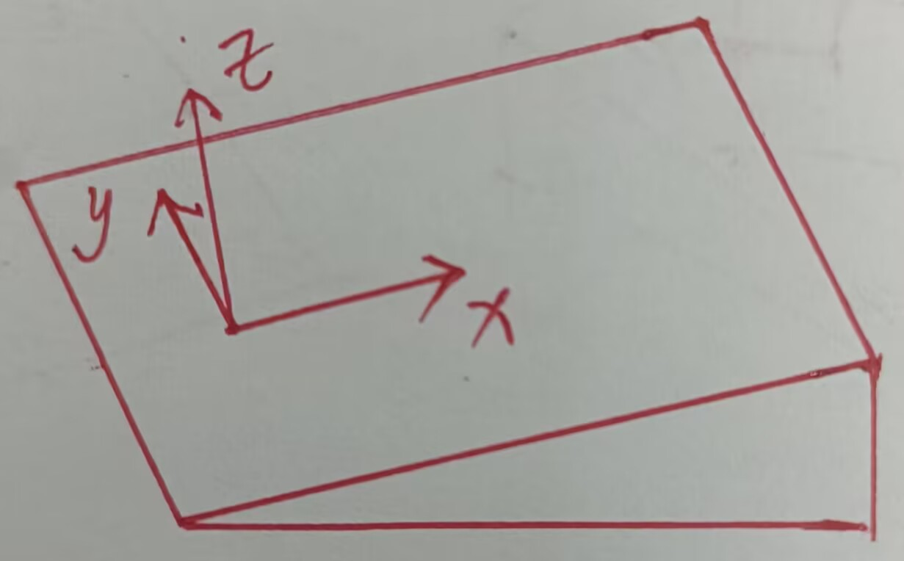

# 推导过程

## 1 回顾

## 2 二维坐标系

- 一些约定俗成的表达方式
  - 字母与标注相关
    - 大写字母是矩阵或者线性空间
    - 小写字母是标量
    - 小写字母带箭头是矢量
    - 希腊字母是角度
    - 角标代表分量或投影
  - 一般情况下, 在矩阵运算中, 直角坐标系下的向量均为列向量. 二维向量有两个分量, 三维向量有三个分量. 这里的分量也可以说是自由度
    - 二维向量$\overrightarrow{p}$的两个分量为$p_x, p_y$, 极坐标表示为$p_r, p_\theta$
    - 三维向量的三个分量为$\overrightarrow{p}$为: $p_x, p_y, p_z$
  - 世界坐标系
    - 世界坐标系用$E$表示
    - 世界坐标系的基
      - 二维坐标系为$\overrightarrow{e}_x = (1, 0), \overrightarrow{e}_y = (0, 1)$
      - 三维坐标系为$\overrightarrow{e}_x = (1, 0, 0), \overrightarrow{e}_y = (0, 1, 0), \overrightarrow{e}_z = (0, 0, 1)$
  - 向量与矩阵左上角的角标表示该矩阵是在某坐标系下而言的, 如$^A\overrightarrow{p}$可以表示坐标系$A$下向量$\overrightarrow{p}$的坐标
    - 世界坐标系下的向量, 左上角的角标可以省略. 如$^E\overrightarrow{p} = \overrightarrow{p}$

### 2.1 向量的旋转

**结论1: **

**对于二维坐标系下的一个向量 $\overrightarrow{p}$, 将其旋转$\alpha$得到新的向量$\overrightarrow{q}$, 则$\overrightarrow{q}$可由某个矩阵$R(\alpha)$左乘向量$\overrightarrow{p}$表示出来, 即:** 
$$
\overrightarrow{q} = R(\alpha) \overrightarrow{p} = \begin{pmatrix}

	\cos(\alpha) & -\sin(\alpha) \\
	
	\sin(\alpha) & \cos(\alpha) \\

\end{pmatrix} \overrightarrow{p}

\label{旋转操作}
$$

**矩阵$R(\alpha)$也叫做旋转矩阵**

> 证明: 
>
> $\overrightarrow{p}$的极坐标表示为$(p_r, p_\theta)$, 且
>
> $$
> p_x = p_r \cos(p_\theta) \\
> 
> p_y = p_r \sin(p_\theta) \\
> 
> \label{极坐标表示}
> $$
>
>
> 而$\overrightarrow{q}$的极坐标表示为$(q_r, q_\theta)$
>
> 根据旋转得知, 旋转后的新坐标的极坐标表示也就是
> $$
> \overrightarrow{q} = (p_r, p_\theta + \alpha)
> $$
> 
>
> 因此有
> $$
> q_x = p_r \cos(p_\theta + \alpha) \\
> 
> q_y = p_r \sin(p_\theta + \alpha) \\
> $$
>
> 利用高中的三角函数和公式
> $$
> q_x = p_r \cos(p_\theta) \cos(\alpha) - p_r \sin(p_\theta) \sin(\alpha) \\
> 
> q_y = p_r \sin(p_\theta) \cos(\alpha) + p_r \cos(p_\theta) \sin(\alpha) \\
> $$
>
> 利用乘法和加法交换律交换顺序, 这样看起来更直观
> $$
> q_x = \cos(\alpha) p_r \cos(p_\theta) - \sin(\alpha) p_r \sin(p_\theta) \\
> 
> q_y = \sin(\alpha) p_r \cos(p_\theta) + \cos(\alpha) p_r \sin(p_\theta) \\
> $$
>
> 再接着代入公式$\eqref{极坐标表示}$
> $$
> q_x = \cos(\alpha) p_x - \sin(\alpha) p_y \\
> 
> q_y = \sin(\alpha) p_x + \cos(\alpha) p_y \\
> $$
>
> 熟悉矩阵乘法的, 一眼就能看出这个算式可以用矩阵乘法表示
> $$
> \begin{pmatrix}
> 
> 	q_x \\
> 
> 	q_y \\
> 
> \end{pmatrix} = \begin{pmatrix}
> 
> 	\cos(\alpha) & -\sin(\alpha) \\
> 
> 	\sin(\alpha) & \cos(\alpha) \\
> 
> \end{pmatrix} \begin{pmatrix}
> 
> 	p_x \\
> 
> 	p_y \\
> 
> \end{pmatrix}
> $$
>
> 也就是
> $$
> \overrightarrow{q} = \begin{pmatrix}
> 
> 	\cos(\alpha) & -\sin(\alpha) \\
> 
> 	\sin(\alpha) & \cos(\alpha) \\
> 
> \end{pmatrix} \overrightarrow{p}
> $$
> 该矩阵就是$R(\alpha)$, 仅与旋转角度有关
> $$
> R(\alpha) = \begin{pmatrix}
> 
> 	\cos(\alpha) & -\sin(\alpha) \\
> 	
> 	\sin(\alpha) & \cos(\alpha) \\
> 
> \end{pmatrix}
> $$
> 此外, $R(\alpha)$显然有下述性质, 是个正交矩阵
> $$
> (R(\alpha))^T = (R(\alpha))^{-1}
> $$

**练习1:**

**将(1, 5)绕原点旋转45°得到新向量, 求这个新向量**

> 代入公式$\eqref{旋转操作}$
> $$
> \overrightarrow{p} = \begin{pmatrix}
> 
> 	1 \\
> 
> 	5 \\
> 
> \end{pmatrix}
> $$
>
> 
> $$
> \alpha = \frac{\pi}{4}
> $$
>
> 
> $$
> R(\alpha) \overrightarrow{p} = \begin{pmatrix}
> 
> 	\cos(\frac{\pi}{4}) & -\sin(\frac{\pi}{4}) \\
> 
> 	\sin(\frac{\pi}{4}) & \cos(\frac{\pi}{4}) \\
> 
> \end{pmatrix} \begin{pmatrix}
> 
> 	1 \\
> 
> 	5 \\
> 
> \end{pmatrix} = \begin{pmatrix}
> 
> 	-2\sqrt{2} \\
> 
> 	3\sqrt{2} \\
> 
> \end{pmatrix}
> $$

**练习2:**

**在练习1的基础上, 将新向量继续转90°, 求旋转后的向量**

> 代入公式$\eqref{旋转操作}$
>
> $$
> \overrightarrow{p} = \begin{pmatrix}
> 
> 	-2\sqrt{2} \\
> 
> 	3\sqrt{2} \\
> 
> \end{pmatrix}
> $$
>
> 
> $$
> \alpha = \frac{\pi}{2}
> $$
>
> 
> $$
> R(\alpha) \overrightarrow{p} = \begin{pmatrix}
> 
> 	\cos(\frac{\pi}{2}) & -\sin(\frac{\pi}{2}) \\
> 
> 	\sin(\frac{\pi}{2}) & \cos(\frac{\pi}{2}) \\
> 
> \end{pmatrix} \begin{pmatrix}
> 
> 	-2\sqrt{2} \\
> 
> 	3\sqrt{2} \\
> 
> \end{pmatrix} = \begin{pmatrix}
> 
> 	-3\sqrt{2} \\
> 
> 	-2\sqrt{2} \\
> 
> \end{pmatrix}
> $$
> 

**练习3:**

**直接将向量(1, 5)绕原点旋转135°, 求旋转后的向量**

> 代入公式$\eqref{旋转操作}$
>
> $$
> \overrightarrow{p} = \begin{pmatrix}
> 
> 	1 \\
> 
> 	5 \\
> 
> \end{pmatrix}
> $$
>
> 
> $$
> \alpha = \frac{3\pi}{4}
> $$
>
> 
> $$
> R(\alpha) \overrightarrow{p} = \begin{pmatrix}
> 
> 	\cos(\frac{3\pi}{4}) & -\sin(\frac{3\pi}{4}) \\
> 
> 	\sin(\frac{3\pi}{4}) & \cos(\frac{3\pi}{4}) \\
> 
> \end{pmatrix} \begin{pmatrix}
> 
> 	1 \\
> 
> 	5 \\
> 
> \end{pmatrix} = \begin{pmatrix}
> 
> 	-3\sqrt{2} \\
> 
> 	-2\sqrt{2} \\
> 
> \end{pmatrix}
> $$
>

### 2.2 旋转后新基下的坐标表示

**结论2:**

**对于二维世界坐标系下的一个向量 $\overrightarrow{p}$, 将坐标系旋转$\alpha$得到新的坐标系A, 设该向量在新坐标系下的坐标为$^A\overrightarrow{p}$, 则**
$$
R(\alpha) \ {^A\overrightarrow{p}} = \overrightarrow{p}
$$
> 证明:
> 
> 等价于将原本的向量旋转$-\alpha$, 代入有
> $$
> ^A\overrightarrow{p} = R(-\alpha) \overrightarrow{p}
> $$
> 两边同时乘上$R(\alpha)$
> $$
> R(\alpha) \ {^A\overrightarrow{p}} = \overrightarrow{p}
> $$

**结论3:**

**对于二维世界坐标系, 将坐标系旋转$\alpha$得到新的坐标系A, 则旋转矩阵中的每一个列向量与新基一一对应, 也就是**
$$
R(\alpha) = \begin{pmatrix}
 
	\overrightarrow{a}_x & \overrightarrow{a}_y \\
 
 \end{pmatrix}
 
 \label{eq3}
$$

> 证明:
>
> 设新基为$\overrightarrow{a_x}$和$\overrightarrow{a_y}$, 根据向量在不同基下的不同表示, 显然有
> $$
> ^Ap_x \overrightarrow{a}_x + {^Ap_y} \overrightarrow{a}_y = p_x \overrightarrow{e}_x + p_y \overrightarrow{e}_y = \begin{pmatrix}
> 
> 	p_x \\
> 	
> 	p_y \\
> 
> \end{pmatrix}
> $$
> 形式化地用矩阵表示, 也就是
> $$
> \begin{pmatrix}
> 
> 	\overrightarrow{a}_x & \overrightarrow{a}_y \\
> 
> \end{pmatrix} \ {^A\overrightarrow{p}} = \overrightarrow{p}
> 
> \label{向量表示旋转矩阵的变换}
> $$
>
>
> 根据旋转矩阵公式, 也就是公式$\eqref{旋转操作}$, 有
> $$
> \overrightarrow{a}_x = R(\alpha) \overrightarrow{e}_x \\
> 
> \overrightarrow{a}_y = R(\alpha) \overrightarrow{e}_y \\
> $$
> 将上式代入公式$\eqref{向量表示旋转矩阵的变换}$, 有
> $$
> \begin{pmatrix}
> 
> 	R(\alpha) \overrightarrow{e}_x & R(\alpha) \overrightarrow{e}_y \\
> 
> \end{pmatrix} \ {^A\overrightarrow{p}} = \overrightarrow{p}
> $$
> 提出来旋转矩阵, 也就是
> $$
> R(\alpha) \begin{pmatrix}
> 
> 	 \overrightarrow{e}_x &  \overrightarrow{e}_y \\
> 
> \end{pmatrix} \ {^A\overrightarrow{p}} = \overrightarrow{p}
> $$
> 由于基向量就是单位矩阵
> $$
> \begin{pmatrix}
> 
> 	 \overrightarrow{e}_x &  \overrightarrow{e}_y \\
> 
> \end{pmatrix} = I
> $$
> 因此化简后, 有
> $$
> R(\alpha) \ {^A\overrightarrow{p}} = \overrightarrow{p}
> $$
> 结合$\eqref{向量表示旋转矩阵的变换}$, 得到关系
> $$
> R(\alpha) = \begin{pmatrix}
> 
> 	\overrightarrow{a}_x & \overrightarrow{a}_y \\
> 
> \end{pmatrix}
> 
> \label{旋转矩阵到基向量}
> $$
> *其实这里如果保证严谨性, 还要说明$R(\alpha)$是满秩矩阵*

**练习4:**

**写出世界坐标系旋转30°对应的旋转矩阵以及对应的基向量**

> 代入公式$\eqref{旋转操作}$
> $$
> \alpha = \frac{\pi}{6}
> $$
> 得到旋转矩阵
> $$
> R(\alpha) = \begin{pmatrix}
> 
> 	\cos(\frac{\pi}{6}) & -\sin(\frac{\pi}{6}) \\
> 
> 	\sin(\frac{\pi}{6}) & \cos(\frac{\pi}{6}) \\
> 
> \end{pmatrix} = \begin{pmatrix}
> 
> 	\frac{\sqrt{3}}{2} & -\frac{1}{2} \\
> 
> 	\frac{1}{2} & \frac{\sqrt{3}}{2} \\
> 
> \end{pmatrix}
> $$
> 根据[结论3](#结论3), 基向量为
> $$
> \begin{pmatrix}
> 
> 	\frac{\sqrt{3}}{2} \\
> 
> 	\frac{1}{2} \\
> 
> \end{pmatrix}, \begin{pmatrix}
> 
> 	-\frac{1}{2} \\
> 
> 	\frac{\sqrt{3}}{2} \\
> 
> \end{pmatrix}
> $$

**练习5:**

**写出负单位矩阵对应的旋转操作以及对应的基向量**

>负单位矩阵
>$$
>\begin{pmatrix}
>
>	-1 & 0 \\
>
>	0 & -1 \\
>
>\end{pmatrix}
>$$
>根据公式$\eqref{旋转操作}$, 令
>$$
>R(\alpha) = \begin{pmatrix}
>
>	\cos(\alpha) & -\sin(\alpha) \\
>	
>	\sin(\alpha) & \cos(\alpha) \\
>
>\end{pmatrix} = \begin{pmatrix}
>
>	-1 & 0 \\
>
>	0 & -1 \\
>
>\end{pmatrix}
>$$
>则
>$$
>\alpha = \pi
>$$
>旋转操作是旋转180°
>
>根据[结论3](#结论3), 基向量显然为
>$$
>\begin{pmatrix}
>
>	-1 \\
>
>	0 \\
>
>\end{pmatrix}, \begin{pmatrix}
>
>	0 \\
>
>	-1 \\
>
>\end{pmatrix}
>$$

**练习6:**

**写出以(-√2/2, √2/2)和(√2/2, √2/2)为基向量，对应的旋转操作以及旋转矩阵**

>根据[结论3](#结论3), 旋转矩阵为
>$$
>\begin{pmatrix}
>
>	-\frac{\sqrt{2}}{2} & \frac{\sqrt{2}}{2} \\
>
>	\frac{\sqrt{2}}{2} & \frac{\sqrt{2}}{2} \\
>
>\end{pmatrix}
>$$
>则有
>$$
>R(\alpha) = \begin{pmatrix}
>
>	\cos(\alpha) & -\sin(\alpha) \\
>	
>	\sin(\alpha) & \cos(\alpha) \\
>
>\end{pmatrix} = \begin{pmatrix}
>
>	-\frac{\sqrt{2}}{2} & \frac{\sqrt{2}}{2} \\
>
>	\frac{\sqrt{2}}{2} & \frac{\sqrt{2}}{2} \\
>
>\end{pmatrix}
>$$
>
>
>然而, 无法根据公式$\eqref{旋转操作}$求解出$\alpha$的具体数值
>
>倘若将坐标系手性翻转, 也就是新坐标系的x与y轴对调, 则有
>$$
>\begin{pmatrix}
>
>	\frac{\sqrt{2}}{2} & -\frac{\sqrt{2}}{2} \\
>
>	\frac{\sqrt{2}}{2} & \frac{\sqrt{2}}{2} \\
>
>\end{pmatrix}
>$$
>根据公式$\eqref{旋转操作}$, 旋转矩阵对应的$\alpha$为$\frac{\pi}{4}$, 旋转操作为旋转45°
>
>显然, 题干中的坐标系, 不满足右手系的规定
>
>旋转操作与旋转矩阵只有一个自由度α
>
>二维坐标系的基有两个自由度, 自由度1确定了第一个基向量的方向, 自由度2确定了第二个基向量是由第一个基向量顺时针还是逆时针旋转90°得到
>
>本题的正交矩阵，实际上是由旋转操作+翻转操作共同作用得到的一个正交矩阵
>
>可以与高中化学里的手性分子类比一下

## 3 欧拉角

## 4 三维坐标系

### 4.1 绕坐标轴旋转

**结论4:**

**三维空间下, z轴/Yaw旋转矩阵, y轴/Pitch旋转矩阵, x轴/Roll旋转矩阵分别为**
$$
Rz(\alpha) = Yaw(\alpha) = \begin{pmatrix}

	\cos(\alpha) & -\sin(\alpha) & 0 \\
	
	\sin(\alpha) & \cos(\alpha) & 0 \\
	
	0 & 0 & 1 \\
 
 \end{pmatrix}
 
 \label{yaw旋转矩阵}
$$

$$
Ry(\beta) = Pitch(\beta) =\begin{pmatrix}

	\cos(\beta) & 0 & \sin(\beta) \\
	
	0 & 1 & 0 \\
	
	-\sin(\beta) & 0 & \cos(\beta) \\
 
 \end{pmatrix}
 
 \label{pitch旋转矩阵}
$$

$$
Rx(\theta) = Roll(\theta) = \begin{pmatrix}

	1 & 0 & 0 \\

	0 & \cos(\theta) & -\sin(\theta) \\
	
	0 & \sin(\theta) & \cos(\theta) \\
 
 \end{pmatrix}
 
 \label{roll旋转矩阵}
$$

> 证明: 
>
> 如果仅将xOy平面绕z轴转动, 或者说对Yaw进行旋转, 因此, x和y分量仍旧像二维情形一样旋转, 而z轴不变
>
> 类比Yaw的旋转方式, 并替换坐标系, 可进一步得到Pitch和Roll坐标系的情况
>
> 如果仅将zOx平面绕y轴转动, 或者说对Pitch进行旋转, 因此, z和x分量仍旧像二维情形一样旋转, 而y轴不变
>
> 如果仅将yOz平面绕x轴转动, 或者说对Roll进行旋转, 因此, y和z分量仍旧像二维情形一样旋转, 而x轴不变

### 4.2 外旋

**结论5:**

**三维空间下, 将一物体按照z-y-x顺序绕世界坐标系旋转$\alpha, \beta, \theta$角度, 最终的旋转矩阵为**
$$
Rzyx(\alpha, \beta, \theta) =   Rx(\theta) Ry(\beta) Rz(\alpha)
$$

**绕世界坐标系旋转多次, 相当于新操作对应的旋转矩阵左乘被旋转坐标系**

> 证明: 
>
> 显然, 对于世界坐标系下的一个向量$\overrightarrow{p}$, 直接将$Rz(\alpha), Ry(\beta), Rx(\theta)$依次左乘这个想要被旋转的向量, 就是结果
>
> 第一步旋转, 绕z轴旋转$\alpha$
> $$
> Rz(\alpha) \overrightarrow{p}
> $$
> 第二步旋转, 绕y轴旋转$\beta$
> $$
> Ry(\beta) Rz(\alpha) \overrightarrow{p}
> $$
> 第三步旋转, 绕x轴旋转$\theta$
> $$
> Rx(\theta) Ry(\beta) Rz(\alpha) \overrightarrow{p}
> $$
> 显然得到了结果
>
> 再抽象一点, 把这个公式代入展开
> $$
> \begin{pmatrix}
> 
> 	\cos(\beta) \cos(\alpha) & -\cos(\beta) \sin(\alpha) & \sin(\beta) \\
> 
> 	\sin(\theta) \sin(\beta) \cos(\alpha) + \cos(\theta) \sin(\alpha) & -\sin(\theta) \sin(\beta) \sin(\alpha) + \cos(\theta) \cos(\alpha) & -\sin(\theta) \cos(\beta) \\
> 
> 	-\cos(\theta) \sin(\beta) \cos(\alpha) + \sin(\theta) \sin(\alpha) & \cos(\theta) \sin(\beta) \sin(\alpha) + \sin(\theta) \cos(\alpha) & \cos(\theta) \cos(\beta) \\
> 
> \end{pmatrix}
> 
> \label{世界坐标系代入展开}
> $$
> 这公式在上位机中, 一般的矩阵库都有, 不用记也不用背, 到时候能用就行
>
> 在嵌入式开发的时候, 为节省算力, 建议直接代入

**练习7:**

**求"先z轴90°, 而后y轴45°"的旋转矩阵**

> 根据[结论4](#结论4)
> $$
> \alpha = \frac{\pi}{2}, \beta = \frac{\pi}{4}
> $$
>
> 
> $$
> Ry(\beta) Rz(\alpha) = \begin{pmatrix}
> 
> 	\cos(\frac{\pi}{4}) & 0 & \sin(\frac{\pi}{4}) \\
> 	
> 	0 & 1 & 0 \\
> 	
> 	-\sin(\frac{\pi}{4}) & 0 & \cos(\frac{\pi}{4}) \\
> 
> \end{pmatrix} \begin{pmatrix}
> 
> 	\cos(\frac{\pi}{2}) & -\sin(\frac{\pi}{2}) & 0 \\
> 	
> 	\sin(\frac{\pi}{2}) & \cos(\frac{\pi}{2}) & 0 \\
> 	
> 	0 & 0 & 1 \\
> 
> \end{pmatrix} = \begin{pmatrix}
> 
> 	0 & -\frac{\sqrt{2}}{2} & \frac{\sqrt{2}}{2} \\
> 	
> 	1 & 0 & 0 \\
> 	
> 	0 & \frac{\sqrt{2}}{2} & \frac{\sqrt{2}}{2} \\
> 
> \end{pmatrix}
> $$

**练习8:**

**求"先y轴45°, 而后z轴90°"的旋转矩阵**

> 类似地, 根据[结论4](#结论4)
> $$
> \alpha = \frac{\pi}{2}, \beta = \frac{\pi}{4}
> $$
>
> $$
> Rz(\alpha) Ry(\beta) = \begin{pmatrix}
> 
> 	\cos(\frac{\pi}{2}) & -\sin(\frac{\pi}{2}) & 0 \\
> 	
> 	\sin(\frac{\pi}{2}) & \cos(\frac{\pi}{2}) & 0 \\
> 	
> 	0 & 0 & 1 \\
> 
> \end{pmatrix} \begin{pmatrix}
> 
> 	\cos(\frac{\pi}{4}) & 0 & \sin(\frac{\pi}{4}) \\
> 	
> 	0 & 1 & 0 \\
> 	
> 	-\sin(\frac{\pi}{4}) & 0 & \cos(\frac{\pi}{4}) \\
> 
> \end{pmatrix} = \begin{pmatrix}
> 
> 	0 & -1 & 0 \\
> 	
> 	\frac{\sqrt{2}}{2} & 0 & \frac{\sqrt{2}}{2} \\
> 	
> 	-\frac{\sqrt{2}}{2} & 0 & \frac{\sqrt{2}}{2} \\
> 
> \end{pmatrix}
> $$
>
> 显然, 这俩结果不一样
>
> 旋转操作不满足交换律, 只满足结合律, 和矩阵的性质是相通的

### 4.3 内旋

**结论6:**

**三维空间下, 将一物体按照Yaw-Pitch-Roll顺序绕物体坐标系旋转$\alpha, \beta, \theta$角度, 最终的旋转矩阵为**
$$
Rypr(\alpha, \beta, \theta) = Yaw(\alpha) Pitch(\beta) Roll(\theta)

\label{欧拉角公式}
$$

**绕物体坐标系旋转多次, 相当于新操作对应的旋转矩阵右乘被旋转坐标系**

> 证明: 
>
> 这次某种程度上不太显然了... 需要换个角度思考
>
> 我们不旋转向量, 而是旋转坐标系, 探究不同坐标系下同一个向量的表达
>
> 设被表达的向量为$\overrightarrow{p}$, 坐标系第一次旋转后对应的坐标系为A, 第二次旋转后对应的坐标系为B, 第三次旋转后对应的坐标系为C
>
> 第一次旋转, 相当于在世界坐标系下绕z轴旋转, 那么$\overrightarrow{p}$的表示为
> $$
> \overrightarrow{p} = Yaw(\alpha) \ {^A\overrightarrow{p}}
> $$
> 第二次旋转, 相当于在坐标系A下绕A的y轴旋转, 那么$^A\overrightarrow{p}$的表示为
> $$
> ^A\overrightarrow{p} = Pitch(\beta) \ {^B\overrightarrow{p}}
> $$
> 第三次旋转, 相当于在坐标系B下绕B的x轴旋转, 那么$^B\overrightarrow{p}$的表示为
> $$
> ^B\overrightarrow{p} = Roll(\theta) \ {^C\overrightarrow{p}}
> $$
> 而$^C\overrightarrow{p}$就是三次旋转后对应的坐标系下向量$\overrightarrow{p}$的表达
>
> 将上述三式迭代进去
> $$
> \overrightarrow{p} = Yaw(\alpha) Pitch(\beta) Roll(\theta) \ {^C\overrightarrow{p}}
> $$
> 根据[结论2](#结论2), 显然得知这三个矩阵连乘就是旋转矩阵, 因此有
> $$
> Rypr(\alpha, \beta, \theta) = Yaw(\alpha) Pitch(\beta) Roll(\theta)
> $$
> 再抽象一点, 把这个公式代入展开
> $$
> \begin{pmatrix}
> 
> 	\cos(\alpha) \cos(\beta) & -\sin(\alpha) \cos(\theta) + \cos(\alpha) \sin(\beta) \sin(\theta) & \sin(\alpha) \sin(\theta) + \cos(\alpha) \sin(\beta) \cos(\theta) \\
> 
> 	\sin(\alpha) \cos(\beta)  & \cos(\alpha) \cos(\theta) + \sin(\alpha) \sin(\beta) \sin(\theta) & -\cos(\alpha) \sin(\theta) + \sin(\alpha) \sin(\beta) \cos(\theta) \\
> 
> 	-\sin(\beta) & \cos(\beta) \sin(\theta) & \cos(\beta) \cos(\theta) \\
> 
> \end{pmatrix}
> 
> \label{物体坐标系代入展开}
> $$
> 同样, 这公式在上位机中, 一般的矩阵库都有, 不用记也不用背, 到时候能用就行
>
> 在嵌入式开发的时候, 为节省算力, 建议直接代入

**练习9:**

**假设一台步兵机器人, 底盘陀螺仪反馈的欧拉角为Yaw90°, Pitch-30°, Roll30°, 求底盘的旋转矩阵**

> 将$\alpha = \frac{\pi}{2}, \beta = -\frac{\pi}{6}, \theta = \frac{\pi}{6}$代入公式$\eqref{物体坐标系代入展开}$, 有
> $$
> \begin{pmatrix}
> 
> 	0 & -\frac{\sqrt{3}}{2} & \frac{1}{2} \\
> 	
> 	\frac{\sqrt{3}}{2} & -\frac{1}{4} & -\frac{\sqrt{3}}{4} \\
> 	
> 	\frac{1}{2} & \frac{\sqrt{3}}{4} & \frac{3}{4} \\
> 
> \end{pmatrix}
> $$

**练习10:**

**如果上一题的底盘是在斜坡上的, 求斜坡的倾角, 底盘在斜坡上的朝向以及斜坡的朝向**

> 首先, 我们脑补一个在斜坡上的底盘
>
> 设底盘Chassis系, 斜坡Slope系的旋转矩阵分别为
> $$
> C, S
> $$
> 其中, 斜坡系的正方向规定如下
>
> 
>
> 事实上, 在世界坐标系里, 底盘朝向是任意的, 斜坡朝向也可以是任意的
>
> 但是! 底盘和斜坡之间的相对位置, 是有一定绑定关系的, 因为底盘和斜坡共面
>
> 这个绑定关系就是: z轴方向向量是一样的, 也就是
> $$
> \overrightarrow{c}_z = \overrightarrow{s}_z
> $$
> 根据上一题, 我们的底盘旋转矩阵已知, 也就是矩阵$C$是已知的
>
> 利用高中数学知识, 求$\overrightarrow{c_z}$  ( 也就是矩阵$C$的第三列分量) 对世界坐标系下xOy平面的夹角 ( 这个夹角也就是斜坡的Pitch角$\beta_{S}$ ) 
> $$
> \beta_{S} = \arctan(\frac{-\sqrt{c_{zx}^2 + c_{zy}^2}}{c_{zz}})
> 
> \label{pitch角已知}
> $$
> 第二步, 我们规定斜坡的欧拉角: Yaw为待求变量$\alpha_{S}$, Pitch角就是$\beta_{S}$, Roll0°
>
> 因此, 得到斜坡的旋转矩阵为
> $$
> S = Yaw(\alpha_{S}) Pitch(\beta_{S}) = \begin{pmatrix}
> 
> 	\cos(\alpha_{S}) \cos(\beta_{S}) & -\sin(\alpha_{S}) & \cos(\alpha_{S}) \sin(\beta_{S}) \\
> 
> 	\sin(\alpha_{S}) \cos(\beta_{S})  & \cos(\alpha_{S}) & \sin(\alpha_{S}) \sin(\beta_{S}) \\
> 
> 	-\sin(\beta_{S}) & 0 & \cos(\beta_{S}) \\
> 
> \end{pmatrix}
> 
> \label{斜坡的旋转矩阵}
> $$
> 因此
> $$
> \overrightarrow{s}_z = \begin{pmatrix}
> 
> 	\cos(\alpha_{S}) \sin(\beta_{S}) \\
> 
> 	\sin(\alpha_{S}) \sin(\beta_{S}) \\
> 
> 	\cos(\beta_{S}) \\
> 
> \end{pmatrix} = \overrightarrow{c}_z
> $$
> $\overrightarrow{c_z}$和$\beta_S$已知, $\alpha_S$求起来轻而易举
>
> 由于底盘陀螺仪已经获取了底盘的Yaw, 也就是$\alpha_C$
>
> 因此, $\alpha_C - \alpha_S$就是底盘相对于斜坡的转角

**练习11:**

**假设一台步兵机器人, 底盘陀螺仪反馈的欧拉角为Yaw90°, Pitch0°, Roll30°, 云台电机编码器角度分别为Yaw30°, Pitch-30°, 求云台的旋转矩阵**

>将$\alpha = \frac{\pi}{2}, \beta = 0, \theta = \frac{\pi}{6}$代入公式$\eqref{物体坐标系代入展开}$, 有底盘的旋转矩阵$C$为
>$$
>C = \begin{pmatrix}
>
>	0 & -\frac{\sqrt{3}}{2} & \frac{1}{2} \\
>
>	1  & 0 & 0 \\
>
>	0 & \frac{1}{2} & \frac{\sqrt{3}}{2} \\
>
>\end{pmatrix}
>$$
>而根据公式$\eqref{欧拉角公式}$, 云台相对于底盘的旋转矩阵$^CG$为
>$$
>^CG = Yaw(30^\circ) Pitch(-30^\circ) = \begin{pmatrix}
>
>	\frac{3}{4} & -\frac{1}{2} & -\frac{\sqrt{3}}{4} \\
>
>	\frac{\sqrt{3}}{4}  & \frac{\sqrt{3}}{2} & -\frac{1}{4} \\
>
>	\frac{1}{2} & 0 & \frac{\sqrt{3}}{2} \\
>
>\end{pmatrix}
>$$
>由于坐标系是随物体运动而变换的, 因此是内旋, 遵循[结论6](#结论6)
>
>因此, 云台的旋转矩阵为
>$$
>G = C {^CG} = \begin{pmatrix}
>
>	-\frac{1}{8} & -\frac{3}{4} & \frac{3\sqrt{3}}{8} \\
>
>	\frac{3}{4}  & -\frac{1}{2} & -\frac{\sqrt{3}}{4} \\
>
>	\frac{3\sqrt{3}}{8} & \frac{\sqrt{3}}{4} & \frac{\sqrt{5}}{8} \\
>
>\end{pmatrix}
>$$

