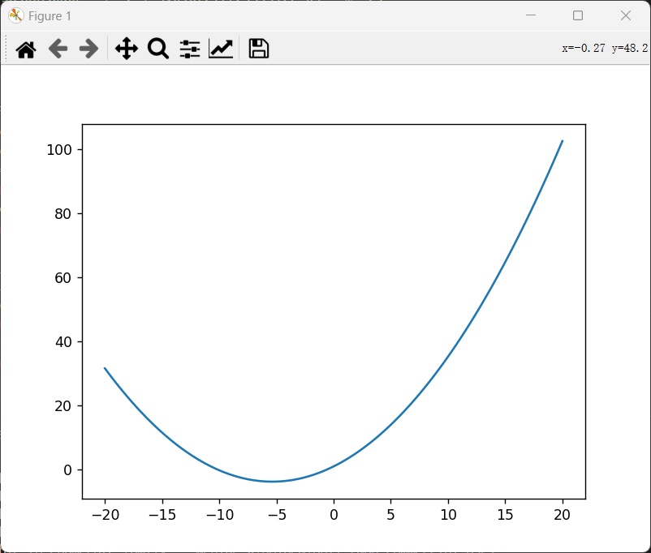

# 推导过程

## 1 回顾

## 2 功率重分配方法

- 规定一些符号
  - 在临门一脚解算出来的数据, 用origin角标表示
  - 电机当前的数据, 用now角标表示
  - 底盘限制的总功率为$P_{max}$
- 准备工作
  - 根据每个轮向电机的当前角速度$\omega_{now, i}$与解算出来的电流$I_{origin, i}$, 计算每个轮向电机在没有功率控制算法情况下的消耗功率$P_{origin, i} = f(I_{origin, i}, \omega_{now, i})$
  - 进一步地, 计算总功率$P_{origin} = \sum_{i=0}^{3}P_{origin, i}$

### 2.1 衰减功率法

- 对准备工作时计算的功率数据进行分析

  - 一般情况下, $P_{origin, i}$可以为正数也可以为负数. 正数对应消耗功率, 负数对应回流功率

    - 定义, 正数功率的电机叫做耗电电机
    - 定义, 负数功率的电机叫做发电电机

  - 如图所示, 是3508电机在当前角速度为100rad/s时的功率-电流曲线, 当电流与转速相反的一段范围内时, 电机功率为负值, 此时就相当于一个发电机

    

- 那么, 我们自然地想到对源功率进行处理

  - 如果$P_{origin} <= P_{max}$

    - 我们不对功率进行任何限制, 直接原封不动给电机发对应的电流值就可以

  - 如果$P_{origin} > P_{max}$

    - 我们可以将发电电机不加以限制, 就要它全额运转, 以获取最大的额外利用空间

    - 对于耗电电机, 我们等比例削减功率, 也就是将功率乘上一个衰减系数$\rho$, 使其降低到限制的功率以内

    - 如下公式所示
      $$
      \sum_{i=0}^3P_{origin, i}Index(P_{origin, i} <= 0) + \rho\sum_{i=0}^3P_{origin, i}Index(P_{origin, i} > 0) = P_{max}
      
      \label{功率衰减系数k计算}
      $$

    - 其中, $Index(condition)$叫做示性函数, 如若符合括号内条件则返回值为1, 否则为0

    - 公式$\eqref{功率衰减系数k计算}$中, 除了$\rho$之外, 其余数据均已知或可计算, 因此我们可以求解出功率衰减因数$\rho$的值

- 而后, 我们考虑, 如何让每个电机工作在指定的功率$\rho P_{origin, i}$上

  - 这时候, 祭出我们的功率建模公式
    $$
    P = f(I, ω) = k_0 + k_1 I + k_2 ω + k_3 I ω + k_4 I^2 + k_5 ω^2
    
    \label{功率建模公式}
    $$
  
- 由于我们已经假设角速度不可突变, 因此用$\rho P_{origin, i}$代入$P$, 用$\omega_{now, i}$代入$\omega$, 即可求解出衰减功率后对应的电流$I$
  
- 然而, 代入上述值后的公式$\eqref{功率建模公式}$是一个关于$I$的一元二次方程, 方程会有两个解. 而我们发给电机的数值只有一个, 因此需要进行取舍

  - 方程形式如下
    $$
    k_4 I^2 + (k_1 + k_3 \omega_{now, i}) I + (-\rho P_{origin, i} + k_0 + k_2 \omega_{now, i} + k_5 \omega_{now, i}^2) = 0
    $$
    
  - 如果方程无解

    - 此时说明, 无论电流取什么值, 电机均无法在给定功率下进行工作
    - 也就意味着, 求根公式$(k_1 + k_3 \omega_{now, i})^2 - 4 k_4 (-\rho P_{origin, i} + k_0 + k_2 \omega_{now, i} + k_5 \omega_{now, i}^2) < 0$
    - 特殊地, 我们做个试验, 代入3508对应的参数, 并假设功率限制为一级血量优先出泉水的45W, 平均到一个轮向电机就是$\rho P_{origin, i} = 11.25$, 得到此时的解集是空集, 并不存在这种情况
    - 仔细想想, 如果遇到无解, 这说明我们的电机并没有工作在一个合理的范围内, 因此不需要考虑
    - 万一, 我说万一, 真出现无解的情况了
      - 直接让$I = 0$, 万事大吉

  - 如果方程有一个解

    - 就你了, 不用想

  - 如果方程有两个解

    - 这种情况其实很多见, 像上面那个图一样, 我们会得到两个解
    - 选择距离$I_{origin, i}$最近的那个

- 这样, 我们就计算得出了最终需要发给电机的电流值

### 2.2 衰减电流法

- 然而, 我们的衰减功率法在某些场景表现可能不是很理想
- 个人分析原因
  - 直接对功率衰减, 经过功率重分配算法后发给电机的扭矩并没有等比例削减的
  - 而且, 我们前几章节讲的就是力控底盘, 大体也是基于整车动力学分析对底盘进行的控制, 映射到每个电机的扭矩做的
  - 对于力控底盘, 如果没有对扭矩等比例衰减, 可能会存在底盘电机之间内耗和打滑的问题
  - 内耗浪费功率, 打滑会使运动偏向失真
- 因此, 如果等比例对电流, 或者说扭矩进行衰减, 也就是对给定的电流值乘上一个衰减系数$\eta$, 这会让底盘的控制更加自如
- 我们仍旧要对源功率与限制功率进行判断
  - 如果$P_{origin} <= P_{max}$
    - 我们不对功率进行任何限制, 直接原封不动给电机发对应的电流值就可以
  - 如果$P_{origin} > P_{max}$
    - 直接解方程$\sum_{i=0}^{3}f(\eta I_{origin, i}, \omega_{now, i})=P_{max}$
- 这是一个关于$\eta$的一元二次方程, 同样, 方程会有两个解
  - 如果方程无解
    - 同样说明此时不合理, 正常情况下不会遇到
    - 如若真遇到了, 让$\eta=0$即可
  - 如果方程有解
    - 如果解都不在0~1之间
      - 这是不合理的
      - 如若真遇到了, 让$\eta=0$
    - 如果解有一个在0~1之间
      - 就你了, 不用想
    - 如果两个都在0~1之间
      - 取较大的那个

## 3 特殊情况分析

### 3.1 单独考虑动力学解算

- 此时, 要解的方程就变成了
  $$
  \sum_{i=0}^{3}f(\eta I_{dynamic, i}+I_{others, i}, \omega_{now, i})
  $$

- $I_{dynamic, i}$是第i个轮向电机的动力学解算部分对应的扭矩电流值

- $I_{others, i}$是第i个轮向电机的其他辅助算法部分对应的扭矩电流值