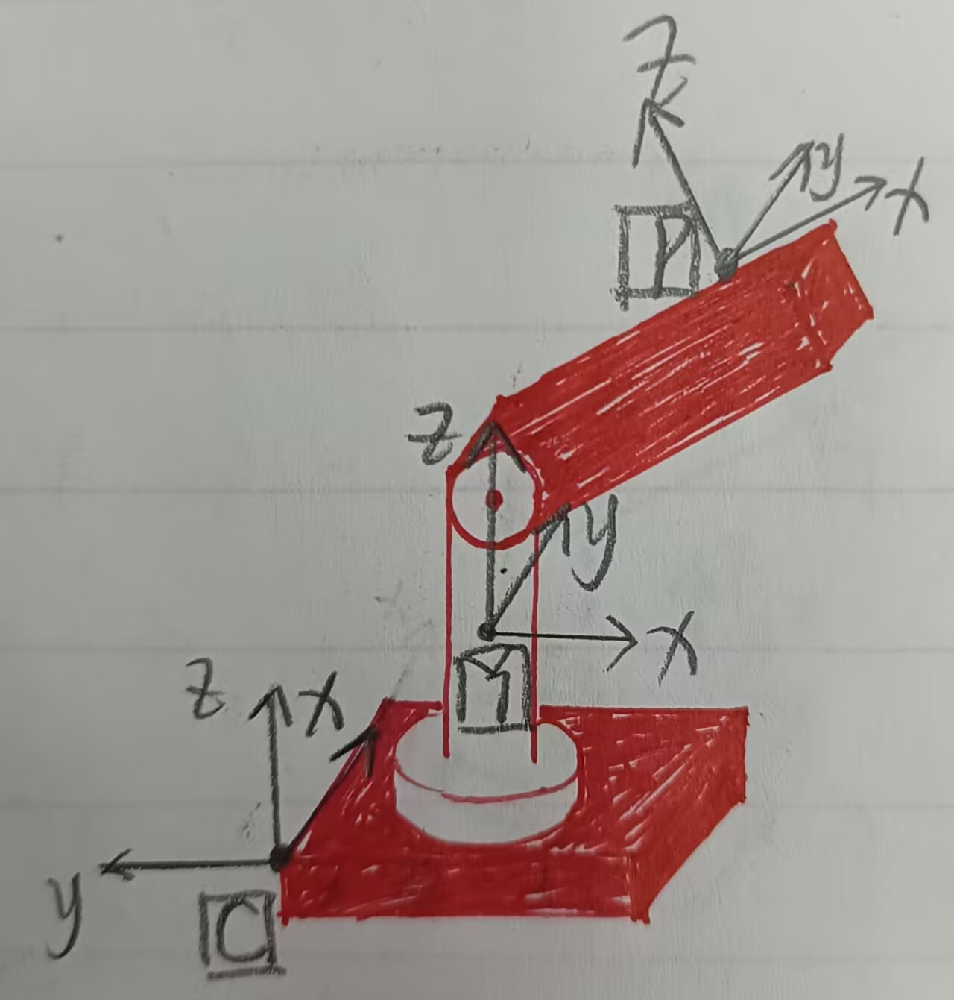

# 结合陀螺仪的控制

## 1 文中数据的符号与含义

- 我们要明确
  - 只有在同一个坐标系下的矢量才可以进行加减运算, 否则需要转换到同一个坐标系下
  - $^A_C\overrightarrow{q}_B$表示$A$坐标系参考情况下, $B$相对于$C$下的任一矢量, C若和A相同则可以删去C

- 相关坐标系定义

  - 大地坐标系为$O$, 即Odometry
  - 底盘坐标系为$C$, 即Chassis
  - 云台Yaw电机转过后的坐标系为$Y$, 即Yaw
  - 云台Pitch电机转过后的坐标系为$P$, 即Pitch
  - 如下图所示为除Odometry坐标系外, 其余三个坐标系的具体位姿

- 云台电机角度

  - 旋转正方向需要符合右手定则

  - 以云台Yaw电机左转为正方向, Yaw轴电机角度为$\alpha$, 设当前角速度为$\dot{\alpha}$

  - 以云台Pitch电机低头为正方向, Pitch轴电机角度为$\beta$, 设当前角速度为$\dot{\beta}$

    > 注: 一个物理量上方带一个点表示其对时间求一阶导数, 带两个点表示求二阶导数, 以此类推

  - 如图所示为$\alpha = -\frac{\pi}{2}, \beta= -\frac{\pi}{4}$的情形

    

- 陀螺仪数据
  - 底盘陀螺仪绑定在底盘$C$上, 当前角速度为$^C_O\overrightarrow{\omega}_C$, 三个轴的角速度分量分别简写为${^C\omega_x}, \ {^C\omega_y}, \ {^C\omega_z}$
  - 云台陀螺仪绑定在云台Pitch端$P$上, 当前角速度为$^P_O\overrightarrow{\omega}_P$, 三个轴的角速度分量分别简写为${^P\omega_x}, \ {^P\omega_y}, \ {^P\omega_z}$

## 2 底盘系

- 各个坐标系间旋转矩阵变换分析
  $$
  ^CY = Yaw(\alpha) \\
  ^YP = Pitch(\beta) \\
  
  \label{旋转矩阵变换分析}
  $$
  
- 旋转角速度分析

  - 我们已知底盘相对大地的角速度$^C_O\overrightarrow{\omega}_C$, 则根据高中物理推广到一般, 有如下递推公式
    $$
    {^Y_O\overrightarrow{\omega}_Y} = \ {^YC} \ {^C_O\overrightarrow{\omega}_C} 
    	+ \dot{\alpha} \overrightarrow{e}_z \\
    	
    {^P_O\overrightarrow{\omega}_P} = \ {^PY} \ {^Y_O\overrightarrow{\omega}_Y} 
    	+ \dot{\beta} \overrightarrow{e}_y \\
    	
    \label{递推公式}
    $$

  - 公式$\eqref{递推公式}$中

    - $^C_O\overrightarrow{\omega}_C$和$^P_O\overrightarrow{\omega}_P$由陀螺仪获取
    - $^YC$是$^CY$的逆矩阵, 或者说转置, $^PY$是$^YP$的逆矩阵, 也是转置, 均可由云台电机编码器读取角度后利用公式$\eqref{旋转矩阵变换分析}$计算即可
    - $\overrightarrow{e}_y$就是单位向量$(0, 1, 0)^T$, $\overrightarrow{e}_z$就是单位向量$(0, 0, 1)^T$
    - 代入具体值, 联立方程即可求解出$\dot{\alpha}, \dot{\beta}$

- 对于单片机嵌入式系统, 此处可能不太适合大量矩阵进行运算, 因此需要求得最终结果

  - 自行求解即可, 锻炼一下计算能力
  
  - 放个结果在这
    $$
    \dot{\alpha} = - \ {^C\omega_z}
    	-  \ {^P\omega_x} \sin(\beta)
    	+ \ {^P\omega_z} \cos(\beta) \\
    	
    \dot{\beta} = \sin(\alpha) \ {^C\omega_x} - \cos(\alpha) \ {^C\omega_y} + \ {^Y\omega_y}
    $$
    

- 控制策略就相对简单了, 只需如下操作
  
  - 电机反馈的Now_Omega换作上述求得的对应角速度
  
    
