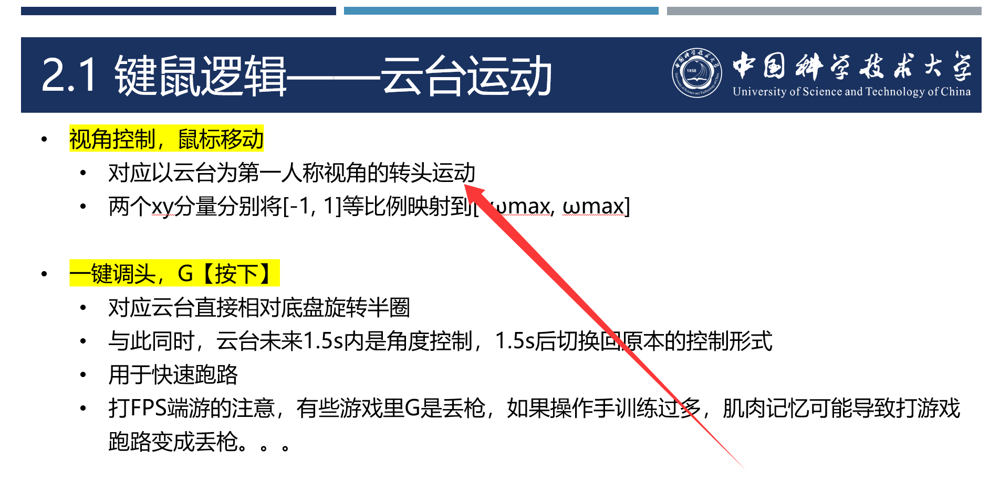
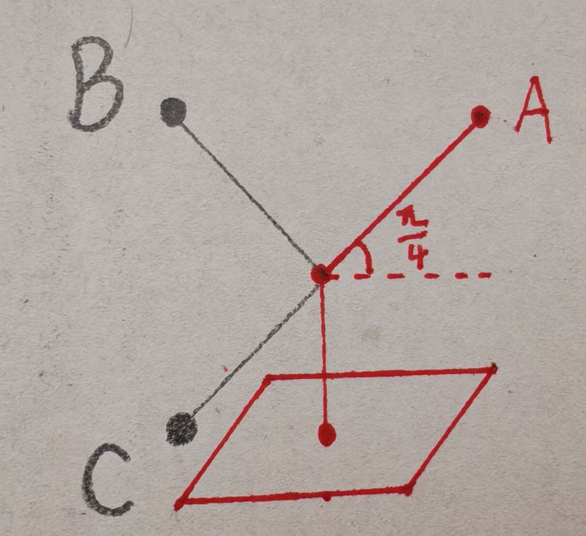

# 关于云台操作逻辑的进一步说明

> 此部分源于2026赛季复活赛前操作手训练期间对英雄机器人调试时发现的问题, 因此做此整理
>
> 在此感谢2026赛季英雄组组长胡宗胜, 新轮腿英雄研发代表兼电控负责人刘子源, 算法组组长金雨润等同学

在本次教程的PPT中, 我在如下图所示的部分提到了以云台为第一人称视角

然而实际上, 这仍旧有两种分类讨论的情况

- 以云台基座所在的坐标系为第一人称视角, 以下简称基座视角
- 以云台末端所在的坐标系为第一人称视角, 以下简称自由视角

举个简单的例子以说明这两种视角的区别, 如下图所示

> 图中说明, 对于一个云台, 它的Pitch轴角度为$-\frac{\pi}{4}$, 也就是图中的A位置. 此时, 我们动动鼠标的X轴, 期望将Yaw轴旋转$\pi$
>
> 当我们在基座视角下控车时, 云台将转动到B位置
>
> 当我们在自由视角下控车时, 云台将转动到C位置

这两种视角的控制逻辑都是有道理的, 并无优劣之分, 下面尝试进行对不同控制方式的特点进行分析

- 基座视角
  - 电机独立运动. 解耦底盘坐标系下的云台Yaw和Pitch轴, Yaw运动不会导致Pitch运动
  - 适合吊射, 也可用于常规操作手控制, 多数队伍采用. RM中, 吊射常见于底盘水平的工况下, 基座视角的控制逻辑可以保证在调整Yaw角度的时候, 不改变Pitch角度, 从而实现仅调整弹道横向落点
  - 代码编写简单. 可以直接在云台Yaw和Pitch电机当前角度基础上, 直接加上鼠标X或Y轴乘上系数的数值 ( 也就是角度增量, 或者说一个和角速度成正比的量 ) 作为云台的新目标角度
  - 该视角也常见于FPS游戏中主角人物的控制逻辑, 大多数以人物对枪的游戏中都采用的是这种策略, 如绝地求生, 反恐精英, 穿越火线等
- 自由视角
  - 电机耦合运动. 耦合了底盘坐标系下的云台Yaw和Pitch轴, Yaw运动会导致Pitch运动
  - 适合自瞄. 自瞄需要的就是云台末端姿态数据, 控制也是基于此
  - 更跟手但需适应时间. RM中, 由于图传和云台末端的姿态是一致的, 因此自由视角的控制逻辑会让操作手在运动中控制云台时, 感觉图传和云台更跟手. 不过这与大多数FPS游戏中的人物控制不同, 因此需要操作手有一定的空间感的适应时间
  - 因此, 这种操作逻辑需进行旋转矩阵映射
    - 对于操作手, 我们需把鼠标X或Y轴乘上系数的数值 ( 也就是角度增量, 或者说一个和角速度成正比的量 ) 乘上底盘到云台的旋转矩阵, 从而恢复到底盘坐标系下, 而后再加上云台Yaw和Pitch电机当前角度, 才能作为云台的新目标角度
    - 对于自瞄, 我们也需把自瞄传来的角度差值, 角速度值, 以及扭矩前馈值, 均乘上底盘到云台的旋转矩阵进行投影, 才能适配到电控层面的云台控制
  - 该视角常见于FPS游戏中某些空中载具和战术道具的控制逻辑, 如三角洲行动的巡飞弹等

