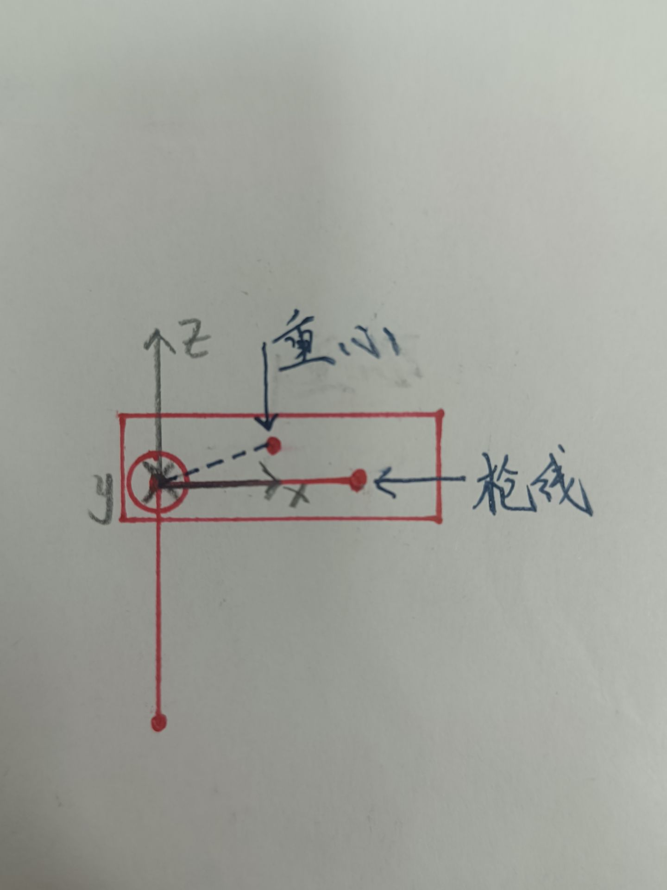
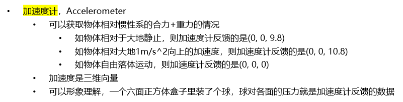

# 云台重力补偿与加速度补偿

## 1 文中数据的符号与含义

- 这一部分源自6.2结合陀螺仪的云台控制中, 但有些许改动

- 我们要明确

  - 只有在同一个坐标系下的矢量才可以进行加减运算, 否则需要转换到同一个坐标系下

- $^A_C\overrightarrow{q}_B$表示$A$坐标系参考情况下, $B$相对于$C$下的任一矢量, C若和A相同则可以删去C

- 相关坐标系定义

  - 大地坐标系为$O$, 即Odometry
  - 底盘坐标系为$C$, 即Chassis
  - 云台Yaw电机转过后的坐标系为$Y$, 即Yaw
  - 云台Pitch电机转过后的坐标系为$P$, 即Pitch
  - 如下图所示为除Odometry坐标系外, 其余三个坐标系的具体位姿

- 云台电机角度

  - 旋转正方向需要符合右手定则

  - 以云台Yaw电机左转为正方向, Yaw轴电机角度为$\alpha$, 设当前角速度为$\dot{\alpha}$

  - 以云台Pitch电机低头为正方向, Pitch轴电机角度为$\beta$, 设当前角速度为$\dot{\beta}$

    > 注: 一个物理量上方带一个点表示其对时间求一阶导数, 带两个点表示求二阶导数, 以此类推

  - 如图所示为$\alpha = -\frac{\pi}{2}, \beta= -\frac{\pi}{4}$的情形

    

- 陀螺仪数据

  - 底盘陀螺仪绑定在底盘$C$上, 当前角速度为$^C_O\overrightarrow{\omega}_C$, 三个轴的角速度分量分别简写为${^C\omega_x}, \ {^C\omega_y}, \ {^C\omega_z}$, ==当前加速度为$^C_O\overrightarrow{a}_C$, 三个轴的加速度分量分别简写为${^Ca_x}, \ {^Ca_y}, \ {^Ca_z}$==
  - 云台陀螺仪绑定在云台Pitch端$P$上, 当前角速度为$^P_O\overrightarrow{\omega}_P$, 三个轴的角速度分量分别简写为${^P\omega_x}, \ {^P\omega_y}, \ {^P\omega_z}$, ==当前加速度为$^P_O\overrightarrow{a}_P$, 三个轴的加速度分量分别简写为${^Pa_x}, \ {^Pa_y}, \ {^Pa_z}$==

## 2 重力补偿

### 2.1 简易的重力补偿

- 首先, 我们考虑一种简易的情况
  
- 底盘位于水平面上, 云台Yaw轴与水平面垂直, 云台Pitch轴与水平面平行
  
- 在这种定义情况下, 我们只需要知道云台Pitch轴电机的重力矩, 即可利用电机输出反向的力矩, 从而平衡掉这个力, 实现重力补偿前馈

- 现在, 我们还要承认一点, 我们在分析云台的转动, 此时就不能当作质点分析. 我们云台的Pitch电机角度, 一般以枪口水平定义为0. 当Pitch电机角度为0时, 也就是云台水平, 此时云台Pitch轴所固连的负载的重心与坐标系$Y$的连线并不一定水平

- 可能听起来比较抽象, 我们具体画图分析, 如图所示. 图中, 云台Pitch轴固连负载的重心相对枪线的旋转角度为$\gamma$

  

- 假设重心相对枪线的旋转角度为$\gamma$, 如上图所示的$\gamma = -\frac{\pi}{12}$. 结合云台的当前Pitch电机角度为$\beta$, 我们可以得知, 重力矩大小$t$满足如下关系

$$
t = m g r \cos(\beta + \gamma)

\label{最开始的公式}
$$
- 其中, $m$是云台Pitch轴所固连的负载的质量, $g$是重力加速度, r是云台Pitch轴所固连的负载的重心与坐标系$V$的原点的距离, 也就是图中的蓝色虚线的长度. 而$\beta$在开篇提过, 就是云台Pitch轴电机的角度

- 有两种计算重力补偿参数的方法, 后文进行详细讲解

#### 2.1.1 测量法

- 测量法很直观
  - 一方面, 我们可以直接按照公式$\eqref{最开始的公式}$, 利用秤来测量云台Pitch轴所固连的负载的质量, 再利用悬挂法确定该负载的重心位置
  - 另一方面, 我们也可以直接找机械要图纸. 一般的工程制图软件都会有相关的计算质量, 重心的功能, 可以直接把数据拿到手

#### 2.1.2 标定法

- 更进一步地, 我们可以有

$$
q + k \cos(\beta + \gamma) = 0
$$

- 其中, $q$是云台Pitch轴电机因重力补偿而输出的扭矩, 待定系数$k=mgr$. 只要我们知道了$k, \gamma$的大小, 重力补偿就完成了

- 具体地, 我们可以给云台电机不同的输出扭矩$q$, 比如$0.2Nm, 0.5Nm$等等, 通过手拨云台Pitch轴来探测云台能稳定的角度范围, 从而获取一系列的$q$与$\beta$的映射关系

- 获取到映射关系后, 就可以利用我们在电机功率建模时早已熟悉的最小二乘法, 来拟合$k,\gamma$这两个参数即可

#### 2.1.3 分析

- $\gamma$的存在性是否有必要
  - 其实这个夹角$\gamma$一般也比较小, 可以忽略. 但原则上如若标定了$\gamma$, 系统确实会有更好的效果
  - 计算出了重力补偿的相关参数后, 我们就可以根据云台电机的当前角度, 结合重力补偿公式与相关参数, 计算出电机需要输出的反向力矩, 从而平衡掉重力带来的影响, 实现重力补偿前馈

- $\gamma$的两种标定方法
  - 测量法中的直接测量法是比较好的, 但需要在机械结构组装时对半成品进行标定. 而图纸测量的内容可能不太精确. 一方面, 我们在后续研发过程中机械图纸上附加一些其他部件, 如走线等; 另一方面, 机械图纸的某些零件可能仅仅有尺寸, 而质量是未知的
  - 标定法相对而言比较通用一些, 而且可以在机械结构成型后进行标定
  - 我一般习惯采用标定法
- 对整个系统建模的分析
  - 我们基于的假设是底盘位于水平面上, 云台Yaw轴与水平面垂直, 云台Pitch轴与水平面平行
  - 这个假设对控制可能有影响, 但对控制有影响也不太可能 ( 常熟阿诺附体 ) 
    - 有影响, 表现在斜坡上, 此时需要结合底盘的具体姿态来进行重力补偿, 而不能简单地认为重力的方向与云台Yaw轴垂直, 甚至我们的Yaw轴电机也需要进行重力补偿
    - 没影响, 表现在我们的补偿只能算个前馈, 有个大致方向就行. 而我们云台仍旧是有, 或者说需要PID反馈控制的, 我们的积分项仍旧可以维持一定的输出值, 从而使云台能够稳定在目标的角度上. 而且稍微有点前馈, 只要大方向对了, 还是比没有前馈要好很多的
  - 为了保证建模的正确性, 我们继续对静力进行更细致的建模

### 2.2 一般的重力补偿

- 我们继续考虑更为普遍的情况

  - 底盘位于任何平面上, 即有一定倾角
  - 机器人本身仍旧正常姿态, 即不包括翻车时底盘在上云台在下的情况
  - 此时, Yaw和Pitch都需要输出对应扭矩来进行重力补偿

- 在这种定义的情况下, 我们需要通过底盘陀螺仪获取底盘的旋转矩阵$^OC$, 结合底盘电机和云台电机角度进行更为细致的分析

- 在上一节中, 我们用更合理的建模, 认为重心的位置是一个待测量的量

- 从这一部分开始直到本篇文章结束, 我们认为==重心在每个机构的末端==. 即云台Yaw轴重心就在坐标系$Y$的原点, 云台Pitch轴重心就在坐标系$P$的原点

- 接下来, 我们计算不同转轴上, 重力对Pitch轴所固连机构作用产生的扭矩

  - 坐标系$P$, 云台Pitch轴转轴的扭矩${^P\overrightarrow{n}_P}$
    $$
    {^P\overrightarrow{n}_P} = -m \ {^P\overrightarrow{g}} \times \ {^P\overrightarrow{r}_Y}
    $$

  - 坐标系$Y$, 云台Yaw轴转轴的扭矩${^P\overrightarrow{n}_P}$
    $$
    {^Y\overrightarrow{n}_P} = -m \ {^Y\overrightarrow{g}} \times \ {^Y_P\overrightarrow{r}_C}
    $$

  - 其中

    - $m$是云台Pitch轴固连负载的质量
    - ${^P\overrightarrow{g}}$, 是坐标系$P$下的重力加速度, 即${^PY} \ {^YC} \ {^CO} {^O\overrightarrow{g}}$
      - 其中
        - $^CO$, 由底盘陀螺仪获取欧拉角后计算而得
        - ${^YC}$, 由云台Yaw电机角度计算得出, 即$Yaw^T(\alpha)$
        - ${^PY}$, 由云台Pitch电机角度计算得出, 即$Pitch^T(\beta)$
        - ${^O\overrightarrow{g}}$, 当地重力加速度, 一般默认$(0, 0, -9.8)$
    - ${^Y\overrightarrow{g}}$, 是坐标系$P$下的重力加速度, 即${^YC} \ {^CO} {^O\overrightarrow{g}}$
      - 其中
        - $^CO$, 由底盘陀螺仪获取欧拉角后计算而得
        - ${^YC}$, 由云台Yaw电机角度计算得出, 即$Yaw^T(\alpha)$
        - ${^O\overrightarrow{g}}$, 当地重力加速度, 一般默认$(0, 0, -9.8)$
    - ${^P\overrightarrow{r}_Y}$, 是坐标系$P$下云台Pitch重心指向坐标系$Y$原点的向量
    - ${^Y_P\overrightarrow{r}_C}$, 是坐标系$Y$下云台Pitch重心指向坐标系$C$原点的向量, 即${^YP} \ {^P\overrightarrow{r}_Y} + \ {^Y\overrightarrow{r}_C}$

- 最后, 将扭矩投影到电机所在的轴上, 即可得到云台Yaw和Pitch电机所需提供的扭矩
  $$
  n_p = {^P\overrightarrow{n}_P^T} \ \overrightarrow{e}_y \\
  
  n_y = {^Y\overrightarrow{n}_P^T} \ \overrightarrow{e}_z
  $$

- 大哥, 搞定! 

## 3 加速度补偿

> **这一部分比较进阶且硬核, 只是为了让大家训练一种力控的思想, 其实上面的简易的重力补偿就已经足够RM电控使用了**

- 为便于进一步分析, 从这里开始, 我们重新定义坐标系$P$的$x$轴方向为==坐标系$Y$原点指向云台Pitch重心的方向==. 这就意味着, 云台的Pitch角度和角速度的参考==不再是云台枪线相对于坐标系$Y$的$x$轴俯仰角==, 而是==云台重心与坐标系$Y$原点连线相对于坐标系$Y$的$x$轴俯仰角==. 换言之, $\beta$的定义发生改变, 变成了原本的$\beta + \gamma$. 而我们对现在坐标系$P$进行矢量分析时, 需要额外对以原本坐标系$P$为参考的矢量 ( 如速度矢量 ) 乘上一个旋转矩阵, 也就是$Pitch^T(\gamma)$进行转换. 如下图所示, 按照原本的定义, $\beta = 0$, 按照现在的定义, $\beta = -\frac{\pi}{12}$

- 一言蔽之: 云台的Pitch坐标系变了

  

- 对于电动的机械结构, 我们这样分析

  - 平动的机构, 如电推杆, 它提供的是力, 也就是$\overrightarrow{f}$
  - 转动的机构, 如关节电机, 它提供的是扭矩, 也就是$\overrightarrow{n}$
  - 此外, 我们默认我们的机械结构是有足够刚度的, 在非机构运动方向上可提供或承受的力和扭矩都是无穷大

- 对于我们的机器人, 我们这样分析

  - 整车包含底盘, 云台Yaw, 云台Pitch三部分主体机构
  - 关于重心的分析
    - 我们可以默认云台Yaw重心在坐标系$C$和坐标系$P$的中点, 云台Pitch重心可通过[2.1.2 标定法](#2.1.2 标定法)的方式获取
  - 关于质量的分析
    - 我们可以通过直接测量, 或工程制图软件计算等方法直接获取
  - 关于惯量矩阵的分析
    - 我们可以粗略将Yaw和Pitch建模为质量均匀且重心居中的杆 ( 注意这里是杆, 不是圆柱体也不是长方体 ) , 而后利用大学物理相关知识计算过重心且方向分别与坐标系$Y$和$P$一致的惯量矩阵

### 3.1 推几个公式

#### 3.1.1 向量叉乘的矩阵形式

- 在底盘的运动学与动力学解算那一章节, 我们已经了解过向量的叉乘, 没有印象的自行回看复习

- 对于两个列向量$\overrightarrow{a}, \overrightarrow{b}$的叉乘, 我们有
  $$
  \overrightarrow{a} \times \overrightarrow{b} 
  	= (a_x, a_y, a_z)^T \times (b_x, b_y, b_z)^T
  	= (a_y b_z - a_z b_y, a_z b_x - a_x b_z, a_xb_y - a_y b_x)^T
  $$

- 此外, 我们还发现
  $$
  (a_y b_z - a_z b_y, a_z b_x - a_x b_z, a_xb_y - a_y b_x)^T = \begin{pmatrix}
  
  	0 & -a_z & a_y \\
  
  	a_z & 0 & -a_x \\
  
  	-a_y & a_x & 0 \\
  
  \end{pmatrix} \begin{pmatrix}
  
  	b_x \\
  	
  	b_y \\
  	
  	b_z \\
  
  \end{pmatrix}
  $$

- 因此, 我们可以把向量叉乘$\overrightarrow{a} \times$当作一个矩阵$A_\times$, 参与后续运算
  $$
  \overrightarrow{a} \times = A_\times = \begin{pmatrix}
  
  	0 & -a_z & a_y \\
  
  	a_z & 0 & -a_x \\
  
  	-a_y & a_x & 0 \\
  
  \end{pmatrix}
  $$

- 这便是向量叉乘的矩阵形式

- 进一步的两个推论

  - 不难发现, $A_\times$是一个反对称矩阵, 即$A_\times + A_\times^T = O$

  - 3阶反对称矩阵有3个自由度, 由这三个变量唯一确定

  - 当向量叉乘遇到旋转矩阵$R$, 有
    $$
    R (\overrightarrow{a} \times \overrightarrow{b})
    	= R (\overrightarrow{a}) \times R (\overrightarrow{b})
    $$
    这里不给出证明过程, 感兴趣同学可自行证明

#### 3.1.2 旋转矩阵, 惯量矩阵, 角速度叉乘对时间的求导

- 我们这一节为了做加速度补偿, 要研究力和扭矩, 而基于的是底盘和云台每个电机的运动状态, 也就是底盘和云台各机构的位置, 速度和加速度等信息

  - 跨坐标系, 难免涉及坐标转换, 因此需要旋转矩阵
  - 在运动过程中, 两个坐标系之间的关系可能错综复杂, 且是时变的, 因此旋转矩阵也是时变的
  - 进一步地, 我们得出结论, 旋转矩阵是时间的函数

- 既然旋转矩阵是时间的函数, 我们先推一下旋转矩阵对时间求导的结果, 后面或许用得到 ( 显然用得到 ) 

- 假设这样一个场景, 我们用来推**旋转矩阵对时间的导数**

  - 一个从坐标系$A$到坐标系$B$的旋转矩阵$^AB$, 简记为$R$, 即Rotation, 

  - 坐标系$B$相对$A$有角速度$^A\overrightarrow{\omega}_B$, 简记为$\overrightarrow{\omega}$

  - 还有一个固连在$B$下的一个点$^B\overrightarrow{q}$ ( 相对坐标系$B$不运动 ) , 简记为$\overrightarrow{q}$, 我们根据速度定义有在坐标系$A$下速度的表达形式
    $$
    \frac{d(R \overrightarrow{q})}{dt} = R \frac{d \overrightarrow{q}}{dt} + \frac{dR}{dt} \overrightarrow{q} = \frac{dR}{dt} \overrightarrow{q}
    $$
  
- 此外, 根据角速度与线速度的关系, 我们还有该点速度的另一个表达方式
    $$
    \overrightarrow{\omega} \times (R \overrightarrow{q}) = \overrightarrow{\omega} \times R \overrightarrow{q}
    $$
    
  - 因此有
  $$
    \frac{dR}{dt} = \overrightarrow{\omega} \times R
  $$
  
- 我们还可以形式化地推广到**惯量矩阵对时间求导**, 这里暂不给出证明过程
  $$
  \frac{dI}{dt} = \overrightarrow{\omega} \times I
  $$

- 此外, 对于**角速度叉乘**这个整体, 我们同样可以把它当成矩阵一样对时间求导
  $$
  \frac{d(\overrightarrow{\omega} \times)}{dt} = \overrightarrow{\alpha} \times
  $$

#### 3.1.3 位置的递推关系

- 现有两个坐标系$A$和$B$

- $A$到$B$, 还有$B$系下一物体$Q$的运动状态, 即位置已知, 具体地

  - 坐标系$B$, 相对$A$的当前坐标$^A\overrightarrow{b}$
  - 物体$Q$, 相对$B$的当前坐标$^B\overrightarrow{q}$

- **位置的递推关系**

  - 显然有
    $$
    ^A\overrightarrow{q} = \ {^A\overrightarrow{b}} + {^AB} \ {^B\overrightarrow{q}}
    $$
    

#### 3.1.4 速度与角速度的递推关系

- 书接上回

- 现有两个坐标系$A$和$B$

- $A$到$B$, 还有$B$系下一物体$Q$的运动状态, 即位置, 速度和角速度已知, 具体地

  - 坐标系$B$, 相对$A$的当前坐标$^A\overrightarrow{b}$, 速度$^A\overrightarrow{v}_B$, 角速度$^A\overrightarrow{ω}_B$
  - 物体$Q$, 相对$B$的当前坐标$^B\overrightarrow{q}$, 速度$^B\overrightarrow{v}_Q$, 角速度$^B\overrightarrow{\omega}_Q$

- **速度的递推关系**

  - 由求导得
    $$
    \begin{align}
    
        \frac{d \ {^A\overrightarrow{q}}}{dt} & = \frac{d(\ {^A\overrightarrow{b}} + {^AB} \ {^B\overrightarrow{q}})}{dt} \\
        
            & = \frac{d\ {^A\overrightarrow{b}}}{dt} + \frac{d({^AB} \ {^B\overrightarrow{q}})}{dt} \\
            
            & = \frac{d\ {^A\overrightarrow{b}}}{dt} + \frac{d({^AB} \ {^B\overrightarrow{q}})}{dt} \\
            
            & = \frac{d\ {^A\overrightarrow{b}}}{dt} + \ {^AB} \frac{d \ {^B\overrightarrow{q}}}{dt}  + \frac{d \ {^AB}}{dt} \ {^B\overrightarrow{q}}
            
    \end{align}
    $$
    
  - 继续代入每一个公式部分, 有
    $$
    \begin{align}
    
        \frac{d \ {^A\overrightarrow{q}}}{dt} & = \frac{d\ {^A\overrightarrow{b}}}{dt} + \frac{d \ {^AB}}{dt} \ {^B\overrightarrow{q}} + \ {^AB} \frac{d \ {^B\overrightarrow{q}}}{dt} \\
            
            & = {^A\overrightarrow{v}}_B + {^AB} \ {^B\overrightarrow{v}_Q} + \ {^A\overrightarrow{\omega}_B} \times {^AB} \ {^B\overrightarrow{q}}
            
    \end{align}
    $$
    
  - 也就是
  $$
    {^A\overrightarrow{v}}_Q = {^A\overrightarrow{v}}_B + {^AB} \ {^B\overrightarrow{v}_Q} + \ {^A\overrightarrow{\omega}_B} \times {^AB} \ {^B\overrightarrow{q}}
  $$

- **角速度的递推关系**

  - 显然有
    $$
    ^A\overrightarrow{\omega}_Q = \ {^A\overrightarrow{\omega}_B} 
    	+ \ {^AB} \ {^B\overrightarrow{\omega}_Q}
    $$
    

#### 3.1.5 加速度与角加速度的递推关系

- 书接上回

- 现有两个坐标系$A$和$B$

- $A$到$B$, 还有$B$系下一物体$Q$的运动状态, 即位置, 速度和角速度已知, 具体地

  - 坐标系$B$, 相对$A$的当前坐标$^A\overrightarrow{b}$, 速度$^A\overrightarrow{v}_B$, 角速度$^A\overrightarrow{ω}_B$, 加速度$^A\overrightarrow{a}_B$, 角加速度$^A\overrightarrow{\alpha}_B$
  - 物体$Q$, 相对$B$的当前坐标$^B\overrightarrow{q}$, 速度$^B\overrightarrow{v}_Q$, 角速度$^B\overrightarrow{\omega}_Q$, 加速度$^B\overrightarrow{a}_Q$, 角加速度$^B\overrightarrow{\alpha}_Q$

- 加速度和角加速度的递推关系不再详细计算, 计算过程与上文大差不差, 直接摆结论, 大家可以自行计算

- **加速度的递推关系**
  $$
  ^A\overrightarrow{a}_Q = \ {^A\overrightarrow{a}_B} 
  	+ \ {^AB} \ {^B\overrightarrow{a}}_Q 
      + 2 \ {^A\overrightarrow{\omega}_B} \times {^AB} \ {^B\overrightarrow{v}}_Q
      + \ {^A\overrightarrow{\alpha}_B} \times {^AB} \ {^B\overrightarrow{q}} 
      + \ {^A\overrightarrow{\omega}_B} \times \ {^A\overrightarrow{\omega}_B} \times {^AB} \ {^B\overrightarrow{q}}
  $$
  
- **角加速度的递推关系**
  $$
  ^A\overrightarrow{\alpha}_Q = \ {^A\overrightarrow{\alpha}_B} 
  	+ \ {^AB} \ {^B\overrightarrow{\alpha}}_Q
  	+ \ {^A\overrightarrow{\omega}_B} \times {^AB} \ {^B\overrightarrow{\omega}}_Q
  $$
  

#### 3.1.6 加速度与力, 角加速度与扭矩的关系

- 我们在大学物理中应当学过如下两个公式, 这里直接摆过来

  - Newton公式, 力的作用点在重心上, 则物体受力$\overrightarrow{f}$与物体质量$m$以及物体加速度$\overrightarrow{a}$的关系为
    $$
    \overrightarrow{f} = \frac{d}{dt}(m \overrightarrow v) = m \overrightarrow a
    $$
  
- Euler公式, 扭矩的作用点在重心上, 则物体受扭矩$\overrightarrow{n}$与物体惯量矩阵$I$, 物体角加速度$\overrightarrow{\alpha}$, 物体角速度$\overrightarrow{\omega}$的关系为
    $$
    \overrightarrow n = \frac{d}{dt}(I \overrightarrow \omega) = I \overrightarrow \alpha + \overrightarrow{\omega} \times I \overrightarrow \omega
    
    \label{扭矩公式}
    $$
    

### 3.2 加速度补偿公式

#### 3.2.1 加速度补偿与重力补偿的关系

- 我们在前面若干章节, 讲述了陀螺仪的相关基础知识. 对于常见的六轴陀螺仪, 我们可以读取到加速度信息, 且会保留重力加速度

- 我们继续举个例子
  - 一个良好跟随云台第一人称视角的底盘以$1m/s^2$向前运动
  - 此时底盘陀螺仪反馈的加速度信息应该是$(1, 0, 9.8)$
  - 显然, $x$分量$1m/s^2$对应了云台Pitch的上抬冲动, 而$z$分量$9.8m/s^2$则对应了重力造成的影响

- 因此, 从这个角度, 我们可以认为加速度补偿是重力补偿的超集

#### 3.2.2 从递推公式到机构的合外力与合外扭矩

- 符号与定义还是按照[1 文中数据的符号与含义](#1 文中数据的符号与含义)的来

- 首先, 根据底盘的角速度, 加速度, 还有云台的角度和角速度, 逐步推算云台Yaw和Pitch轴的加速度和角加速度, 并转化到对应轴的参考系下

  - 根据上面的迭代公式不难发现, 底盘的位置和速度对结果无影响, 云台的位置由机械图纸固定的, 而速度为0
  - 舍去无关量, 计算得出结果
  - 其实计算方法多种多样, 能找到合适的方法就行
    - 递推公式法
    - 求导法

- 我们再温习一下那个坐标系的图

  

- 对机器人各个机械结构进行分析

  - 底盘

    - 速度$^C_O\overrightarrow{v}_C$, 由底盘电机运动学逆解算获得
    - 角速度$^C_O\overrightarrow{\omega}_C$, 由底盘陀螺仪获得
    - 加速度$^C_O\overrightarrow{a}_C$, 由底盘陀螺仪获得
    - 角加速度$^C_O\overrightarrow{\alpha}_C$, 由底盘陀螺仪角速度差分计算得出 ( 此处建议走一个低通滤波器, 关于滤波器设计将在后面的篇章额外重点讲解 )

  - 云台Yaw

    - 速度$^Y_O\overrightarrow{v}_Y$
      $$
      ^Y_O\overrightarrow{v}_Y = \ {^YC} (
      	\ {^C_O\overrightarrow{v}_C}
      		+ \ {^C_O\overrightarrow{\omega}_C} \times \ {^C\overrightarrow{y}}
      )
      $$

      - ${^YC}$, 由云台Yaw电机角度计算得出, 即$Yaw^T(\alpha)$
      - ${^C\overrightarrow{y}}$, 由坐标系$C$原点指向$Y$原点的向量
      - ${^C_O\overrightarrow{v}_C}$, 底盘速度
      - ${^C_O\overrightarrow{\omega}_C}$, 底盘角速度

    - 角速度$^Y_O\overrightarrow{\omega}_Y$
      $$
      ^Y_O\overrightarrow{\omega}_Y = \ {^YC} \ {^C_O\overrightarrow{\omega}_C} 
      	+ \ {^Y_C\overrightarrow{\omega}_Y}
      $$

      - ${^YC}$, 由云台Yaw电机角度计算得出, 即$Yaw^T(\alpha)$
      - ${^C_O\overrightarrow{\omega}_C}$, 底盘速度
      - ${^Y_C\overrightarrow{\omega}_Y}$, 云台Yaw电机角速度, 即$\dot{\alpha} \overrightarrow{e}_z$

    - 加速度$^Y_O\overrightarrow{a}_Y$
      $$
      ^Y_O\overrightarrow{a}_Y = \ {^YC} (
      	\ {^C_O\overrightarrow{a}_C}
              + \ {^C_O\overrightarrow{\alpha}_C} \times \ {^C\overrightarrow{y}}
              + \ {^C_O\overrightarrow{\omega}_C} \times \ {^C_O\overrightarrow{\omega}_C} \times \ {^C\overrightarrow{y}}
      )
      $$

      - ${^YC}$, 由云台Yaw电机角度计算得出, 即$Yaw^T(\alpha)$
      - ${^C\overrightarrow{y}}$, 由坐标系$C$原点指向$Y$原点的向量
      - ${^C_O\overrightarrow{\omega}_C}$, 底盘角速度
      - ${^C_O\overrightarrow{a}_C}$, 底盘加速度
      - ${^C_O\overrightarrow{\alpha}_C}$, 底盘角加速度

    - 角加速度$^Y_O\overrightarrow{\alpha}_Y$

      $$
      ^Y_O\overrightarrow{\alpha}_Y = \ {^YC} (
      	\ {^C_O\overrightarrow{\alpha}_C}
      		+ \ {^C_O\overrightarrow{\omega}_C} \times {^Y_C\overrightarrow{\omega}_Y}
      ) 
      	+ {^Y_C\overrightarrow{\alpha}_Y}
      $$
      - ${^YC}$, 由云台Yaw电机角度值计算得出, 即$Yaw^T(\alpha)$
      - ${^C_O\overrightarrow{\omega}_C}$, 底盘角速度
      - ${^C_O\overrightarrow{\alpha}_C}$, 底盘角加速度
      - ${^Y_C\overrightarrow{\omega}_Y}$, 云台Yaw电机角速度, 即$\dot{\alpha} \overrightarrow{e}_z$
      - ${^Y_C\overrightarrow{\alpha}_Y}$, 云台Yaw电机角加速度, 即$\ddot{\alpha} \overrightarrow{e}_z$, 由云台Yaw电机角速度差分计算得出 ( 此处建议走一个低通滤波器, 关于滤波器设计将在后面的篇章额外重点讲解 )

  - 云台Pitch

    - 速度$^P_O\overrightarrow{v}_P$
      $$
      ^P_O\overrightarrow{v}_P = \ {^PY} (
      	\ {^Y_O\overrightarrow{v}_Y}
      		+ \ {^Y_O\overrightarrow{\omega}_Y} \times \ {^Y\overrightarrow{p}}
      )
      $$

      - ${^PY}$, 由云台Pitch电机角度计算得出, 即$Pitch^T(\beta)$
      - ${^Y\overrightarrow{p}}$, 由坐标系$Y$原点指向$P$原点的向量
      - ${^C_O\overrightarrow{v}_C}$, 云台Yaw速度
      - ${^C_O\overrightarrow{\omega}_C}$, 云台Yaw角速度

    - 角速度$^P_O\overrightarrow{\omega}_P$
      $$
      ^P_O\overrightarrow{\omega}_P = \ {^PY} \ {^Y_O\overrightarrow{\omega}_Y} 
      	+ \ {^P_Y\overrightarrow{\omega}_P}
      $$

      - ${^PY}$, 由云台Pitch电机角度计算得出, 即$Pitch^T(\beta)$
      - ${^Y_O\overrightarrow{\omega}_Y}$, 云台Yaw角速度
      - ${^P_Y\overrightarrow{\omega}_P}$, 云台Pitch电机角速度, 即$\dot{\beta} \overrightarrow{e}_y$

    - 加速度$^P_O\overrightarrow{a}_P$
      $$
      ^P_O\overrightarrow{a}_P = \ {^PY} (
      	\ {^Y_O\overrightarrow{a}_Y}
              + \ {^Y_O\overrightarrow{\alpha}_Y} \times \ {^Y\overrightarrow{p}}
              + \ {^Y_O\overrightarrow{\omega}_Y} \times \ {^Y_O\overrightarrow{\omega}_Y} \times \ {^Y\overrightarrow{p}}
      )
      $$

      - ${^PY}$, 由云台Pitch电机角度计算得出, 即$Pitch^T(\beta)$
      - ${^Y\overrightarrow{p}}$, 由坐标系$Y$原点指向$P$原点的向量
      - ${^Y_O\overrightarrow{\omega}_Y}$, 云台Yaw角速度
      - ${^Y_O\overrightarrow{a}_Y}$, 云台Yaw加速度
      - ${^Y_O\overrightarrow{\alpha}_Y}$, 云台Yaw角加速度

    - 角加速度$^P_O\overrightarrow{\alpha}_P$
      $$
      ^P_O\overrightarrow{\alpha}_P = \ {^PY} (
      	\ {^Y_O\overrightarrow{\alpha}_Y}
      		+ \ {^Y_O\overrightarrow{\omega}_Y} \times {^P_Y\overrightarrow{\omega}_P}
      ) 
      	+ {^P_Y\overrightarrow{\alpha}_P}
      $$
      - ${^PY}$, 由云台Yaw电机角度值计算得出, 即$Yaw^T(\alpha)$
      - ${^Y_O\overrightarrow{\omega}_Y}$, 云台Yaw角速度
      - ${^Y_O\overrightarrow{\alpha}_Y}$, 云台Yaw角加速度
      - ${^P_Y\overrightarrow{\omega}_P}$, 云台Pitch电机角速度, 即$\dot{\beta} \overrightarrow{e}_y$
      - ${^P_Y\overrightarrow{\alpha}_P}$, 云台Pitch电机角加速度, 即$\ddot{\beta} \overrightarrow{e}_y$, 由云台Pitch电机角速度差分计算得出 ( 此处建议走一个低通滤波器, 关于滤波器设计将在后面的篇章额外重点讲解 )

- 我们利用公式, 逐步确定了两个云台的速度, 角速度, 加速度和角加速度

- 接下来, 我们代入Newton公式和Euler公式, 求解两个云台分别所需的合外力和合扭矩

- 此时, 我们再次明确, 对转动的分析, 将在各个结构的转轴上进行

  - 云台Yaw
    - 合外力, $^Y\overrightarrow{\phi}_Y = m_Y \ {^Y_O\overrightarrow{a}_Y}$
    - 合外扭矩, $^Y\overrightarrow{\tau}_Y = I_{Y} \ {^Y_O\overrightarrow{\alpha}_Y} + \ {^Y_O\overrightarrow{\omega}_Y} \times I_{Y} \ {^Y_O\overrightarrow{\omega}_Y}$
  - 云台Pitch

    - 合外力, $^P\overrightarrow{\phi}_P = m_P \ {^P_O\overrightarrow{a}_P}$
    - 合外扭矩, $^P\overrightarrow{\tau}_P = I_{P} \ {^P_O\overrightarrow{\alpha}_P} + \ {^P_O\overrightarrow{\omega}_P} \times I_{P} \ {^P_O\overrightarrow{\omega}_P}$

#### 3.2.3 将合外力与合外扭矩推到云台电机的扭矩

- 先计算出我们需要的力和扭矩
  - 云台Pitch
    - 支持力, ${^P\overrightarrow{f}_P} = \ {^P\overrightarrow{\phi}_P}$
    - 转动扭矩, ${^P\overrightarrow{n}_P} = \ {^P\overrightarrow{\tau}_P} + \ {{^P\overrightarrow{y}}} \times \ {^P\overrightarrow{\phi}_P}$
  - 云台Yaw
    - 支持力, ${^Y\overrightarrow{f}_Y} = \ {^YP} \ {^P\overrightarrow{\phi}_P} + \ {^Y\overrightarrow{\phi}_Y}$
    - 转动扭矩, ${^Y\overrightarrow{n}_Y} = \ {^Y\overrightarrow{\tau}_Y} + \ {^YP} \ {^P\overrightarrow{n}_P} + \ {{^Y\overrightarrow{c}}} \times \ {^Y\overrightarrow{\phi}_Y} + \ {^Y\overrightarrow{p}} \times \ {^YP} \ {^P\overrightarrow{f}_P}$
- 计算出对应的扭矩后, 我们直接将扭矩投影到电机对应的方向上, 从而得到电机所需提供的扭矩
  - 云台Pitch
    - 投影扭矩,  $n_p = {^P\overrightarrow{n}^T_P} \ \overrightarrow{e}_y$
  - 云台Yaw
    - 投影扭矩, $n_y = {^Y\overrightarrow{n}^T_Y} \ \overrightarrow{e}_z$

### 3.3 总结

- 这一部分, 当个乐子就好...

