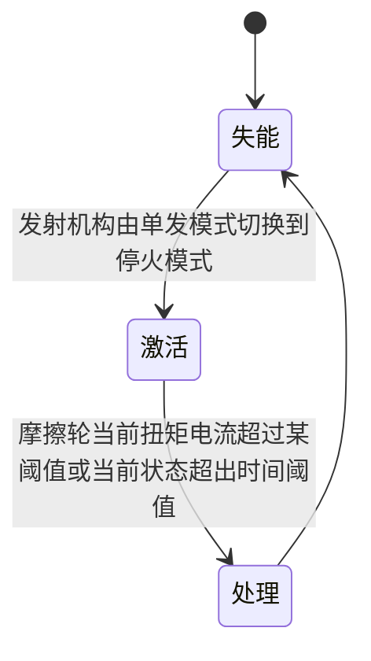
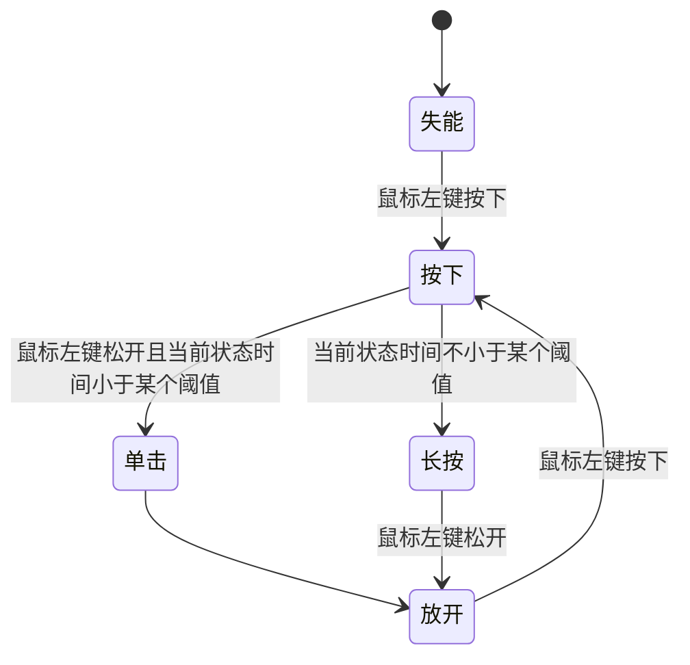
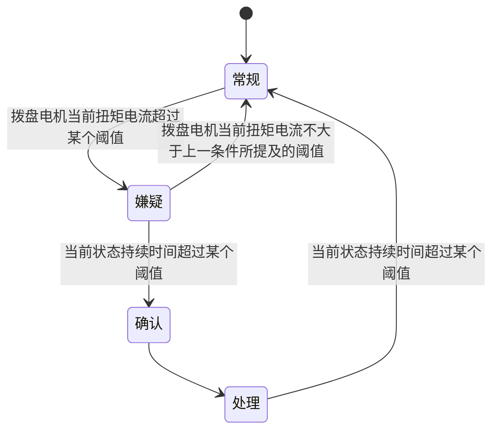
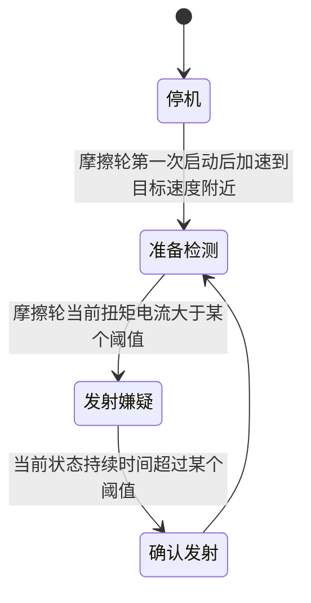
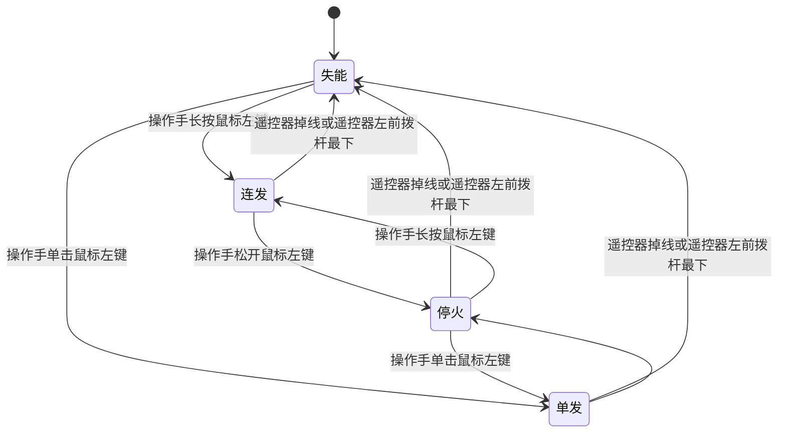

# 1 停火有限状态机

```mermaid
stateDiagram-v2
	[*] --> 失能
	失能 --> 激活 : 发射机构由单发模式切换到停火模式
	激活 --> 处理 : 摩擦轮当前扭矩电流超过某阈值或当前状态超出时间阈值
	处理 --> 失能
```

# 2 单击有限状态机

```mermaid
stateDiagram-v2
	[*] --> 失能
	失能 --> 按下 : 鼠标左键按下
	按下 --> 单击 : 鼠标左键松开且当前状态时间小于某个阈值
	按下 --> 长按 : 当前状态时间不小于某个阈值
	放开 --> 按下 : 鼠标左键按下
	单击 --> 放开
	长按 --> 放开 : 鼠标左键松开
```

# 3 卡弹有限状态机

```mermaid
stateDiagram-v2
	[*] --> 常规
	常规 --> 嫌疑 : 拨盘电机当前扭矩电流超过某个阈值
	嫌疑 --> 常规 : 拨盘电机当前扭矩电流不大于上一条件所提及的阈值
	嫌疑 --> 确认 : 当前状态持续时间超过某个阈值
	确认 --> 处理
	处理 --> 常规 : 当前状态持续时间超过某个阈值
```

# 4 热量检测有限状态机

```mermaid
stateDiagram-v2
	[*] --> 停机
	停机 --> 准备检测 : 摩擦轮第一次启动后加速到目标速度附近
	准备检测 --> 发射嫌疑 : 摩擦轮当前扭矩电流大于某个阈值
	发射嫌疑 --> 确认发射 : 当前状态持续时间超过某个阈值
	确认发射 --> 准备检测
```

# 5 发射有限状态机

```mermaid
stateDiagram-v2
    [*] --> 失能
    失能 --> 连发 : 操作手长按鼠标左键
    失能 --> 单发 : 操作手单击鼠标左键
    停火 --> 失能 : 遥控器掉线或遥控器左前拨杆最下
    停火 --> 连发 : 操作手长按鼠标左键
    停火 --> 单发 : 操作手单击鼠标左键
    连发 --> 失能 : 遥控器掉线或遥控器左前拨杆最下
    连发 --> 停火 : 操作手松开鼠标左键
    单发 --> 失能 : 遥控器掉线或遥控器左前拨杆最下
    单发 --> 停火
```

