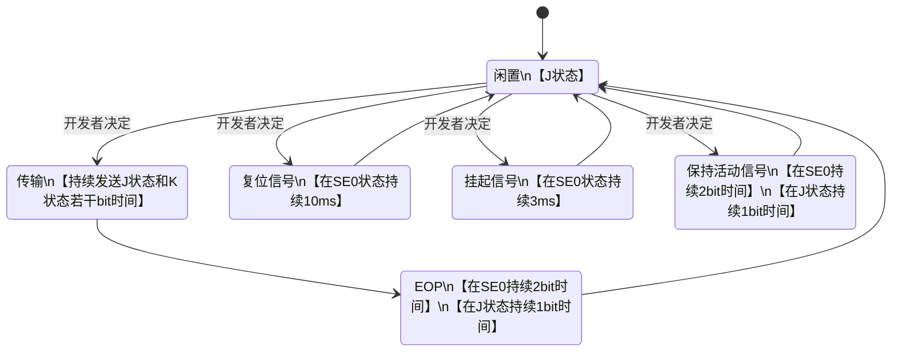
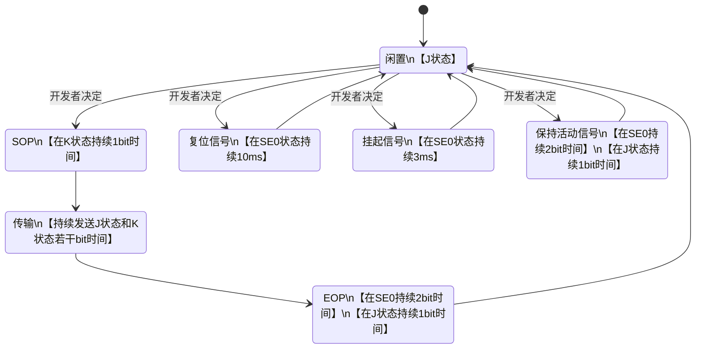
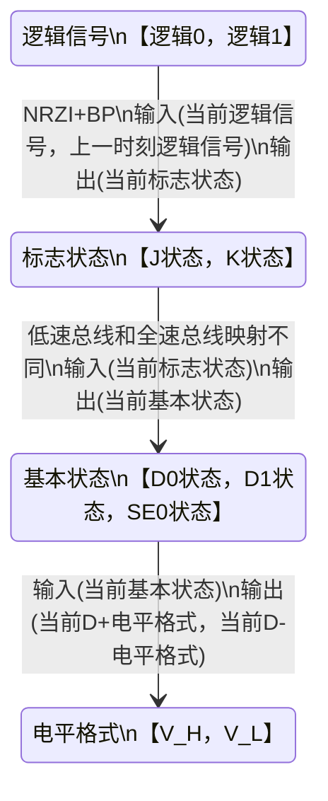
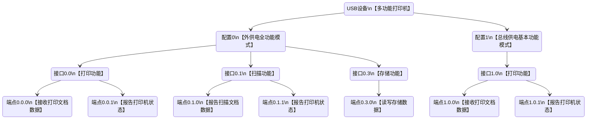

# USB官方文档链接

https://www.usb.org/documents

# USB1.0低速设备



# USB1.0全速设备



# USB1.0编码情况



# 例题

渲染网站：https://wavedrom.com/editor.html

```wavedorm
{
  signal: [
  	{
      name: 'clk(实际没有)', 
      wave:"=================",
    },
    
    {
      name: 'D+', 
      wave: 'h.lh......lhl.h..',
    },
    
    {
      name: 'D-', 
      wave: 'l.hl......hl.....'
    },
    
    {
      name: '基本状态', 
      wave: '=================', 
      data: ['D1', 'D1', 'D0', 'D1', 'D1', 'D1', 'D1', 'D1', 'D1', 'D1', 'D0', 'D1', 'SE0', 'SE0', 'D1', 'D1', 'D1'],
    },
    
    {
      name: '标志状态', 
      wave: '=================', 
      data: ['J', 'J', 'K', 'J', 'J', 'J', 'J', 'J', 'J', 'J', 'K', 'J', 'SE0', 'SE0', 'J', 'J', 'J'],
    },
    
    {
      name: '总线状态', 
      wave: '3.45........7..3.', 
      data: ['闲置', 'SOP', '传输', 'EOP', '闲置']
    },
    
    {
      name: '传输数据', 
      wave: 'xxx=========xxxxx', 
      data: [0, 1, 1, 1, 1, 1, 1, 'BP', 0],
    },
]}

```

# 打印机举例



