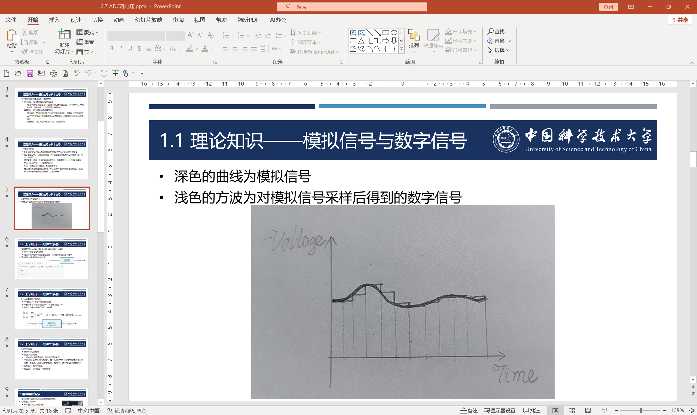

# 观测器概述

## 1 观测器的模型

在现代控制理论中, 观测器系统的模型由两类模型组成: 过程模型和测量模型

### 1.1 过程模型

- 描述物理系统模型随**时间演化**的结构

- 一般是与状态信息相关的, 含有**状态信息与控制器输出信息**的微分方程或差分方程

  - 如果是连续时间系统, 则对应微分方程
    $$
    \dot{\overrightarrow s}(t) = \overrightarrow f(\overrightarrow s(t), \overrightarrow c(t))
    
    \label{连续过程模型}
    $$

  - 如果是离散时间系统, 则对应差分方程
    $$
    \overrightarrow s_{n + 1} = \overrightarrow f(\overrightarrow s_{n}, \overrightarrow c_{n})
    
    \label{离散过程模型}
    $$

  - 其中

    - $\overrightarrow s$是被观测的所有状态信息拼接而成的向量, 即state
    - $\overrightarrow c$是控制器输出的所有控制量拼接而成的向量, 即control
    - $\overrightarrow f$是过程模型函数

### 1.2 测量模型

- 描述**传感器示数**对当前状态贡献的结构

- 一般是与状态信息相关的, 由**状态信息映射到传感器反馈信息**的向量函数

  - 如果是连续时间系统
    $$
    \overrightarrow m(t) = \overrightarrow h(\overrightarrow s(t))
    
    \label{连续测量模型}
    $$

  - 如果是离散时间系统
    $$
    \overrightarrow m_n = \overrightarrow h(\overrightarrow s_n)
    
    \label{离散测量模型}
    $$

  - 其中

    - $\overrightarrow m$是传感器的所有反馈信息拼接而成的向量, 即measure
    - $\overrightarrow h$是测量模型函数

## 2 研究的举物体的模型对象

- 我们的目标

  - 设计观测器, 根据传感器输出的位置信息, 和控制器输出的推力信息, 从而推算出物体的位置, 速度信息
  - 考虑到噪声与扰动, 因此会给传感器返回的位置信息以及控制器输出的推力信息均引入一个Gauss分布的噪声
    - 在我们电控基础篇中的PID控制器部分, 设计控制器的时候没有考虑过噪声和扰动
    - 虽然当时没考虑过, 但由于PID控制系统本身有低通滤波器的特性 ( 将在频选滤波器部分解释 ) , 所以可以通过设置一个合理的参数后, 实现稳定的控制与跟随, 从而克服随机的噪声和扰动

- 具体到模型

  - 被研究的模型是举物体模型

    - 质量为$m$的物体只进行一维运动, 也就是位置$x(t)$, 速度$v(t)$, 加速度$a(t)$都是带有正负号的标量
    - 规定向上为正方向
    - 物体受力分析
      - 物体受到$G$的重力, 考虑到向上为正方向, 因此其值为负值
      - 物体受到与速度成正比的空气阻力, 系数为$k$, 考虑到与速度反向, 因此其值为负值
      - 物体受到控制器输出的推力$F(t)$

  - 数据相关

    - 通过控制器输出的推力为$F$, 且带有遵循正态分布的噪声$n_F \sim N(0, \sigma_F^2)$
    - 通过传感器反馈的位置数据为$x$, 且带有遵循正态分布的噪声$n_x \sim N(0, \sigma_x^2)$

  - 代入到公式$\eqref{连续过程模型}$和公式$\eqref{连续测量模型}$中的变量, 有
    $$
    \overrightarrow s(t) = \begin{pmatrix}
    
    	x(t) \\
    	
    	v(t)
    
    \end{pmatrix} \\
    
    \overrightarrow m(t) = \begin{pmatrix}
    
    	x(t)
    
    \end{pmatrix} \\
    
    \overrightarrow c(t) = \begin{pmatrix}
    
    	F(t)
    
    \end{pmatrix} \\
    $$

  - 接下来, 我们就是要探究这个举物体的模型下, 过程模型$\overrightarrow f$和测量模型$\overrightarrow h$的表示方法

### 2.1 过程模型

- 我们要观测的是位置和速度信息, 因此需要列位置和速度相关的微分方程, 也就是形如下述等式
  $$
  \begin{pmatrix}
  
  	\dot x(t) \\
  	
  	\dot v(t)
  
  \end{pmatrix} = \overrightarrow f( \begin{pmatrix}
  
  	x(t) \\
  	
  	v(t)
  
  \end{pmatrix}, \begin{pmatrix}
  
  	F(t)
  
  \end{pmatrix})
  $$
  
- 对于等式左侧的第一项, 位置导数$\dot x(t)$, 也就是速度,直接就是等式右侧的$v(t)$

  因此, 对于等式左侧第一项, 我们可以直接表示为
  $$
  \dot x(t) = v(t)
  
  \label{过程模型等式第一项}
  $$
  
- 对于等式左侧的第二项, 速度导数$\dot v(t)$, 也就是加速度, 需要对物体进行受力分析
  $$
  \dot v(t) = \frac{F(t) + G + k v(t)}{m}
  $$
  整理一下, 即为
  $$
  \dot v(t) = \frac{k}{m}v(t) + \frac{1}{m}F(t) + \frac{G}{m}
  
  \label{过程模型等式第二项}
  $$

- 联立公式$\eqref{过程模型等式第一项}$和公式$\eqref{过程模型等式第二项}$这两个被观测的状态信息, 最终得出过程模型的微分方程结构
  $$
  \begin{pmatrix}
  
  	\dot x(t) \\
  	
  	\dot v(t)
  
  \end{pmatrix} = \begin{pmatrix}
  
  	v(t) \\
  	
  	\frac{k}{m}v(t) + \frac{1}{m}F(t) + \frac{G}{m}
  
  \end{pmatrix}
  $$
  
- 这里先分享一下我个人总结的小思想

  - 控制器和观测器的核心目的都是抗噪抗扰
  - 控制器要通过建模, 把决策局部最优化, 误差error线性化
  - 观测器要通过建模, 把噪声信号去耦化, 噪声分布正态化, 噪声方差最小化

- 因此, 线性化是很重要的一环, 我们的公式也最好是线性化的, 这样有助于进一步分析, 将上面的等式转变一种形式后, 就得到了
  $$
  \begin{pmatrix}
  
  	\dot x(t) \\
  	
  	\dot v(t)
  
  \end{pmatrix} = \begin{pmatrix}
  
  	0 & 1 \\
  	
  	0 & \frac{k}{m}
  
  \end{pmatrix} \begin{pmatrix}
  
  	x(t) \\
  	
  	v(t)
  
  \end{pmatrix} + \begin{pmatrix}
  
  	0 \\
  	
  	\frac{1}{m}F(t) + \frac{G}{m}
  
  \end{pmatrix}
  
  \label{举物体的过程模型}
  $$
  这就是关于状态信息$(x(t), v(t))^T$的一个微分方程, 而且是一个一阶非齐次常系数微分方程, 可以通过在数学分析中学过的常数变易法求得通解和特解

### 2.2 测量模型

- 我们传感器只能获取位置信息, 因此测量模型要建立的就是如下的关系
  $$
  \begin{pmatrix}
  
  	x(t)
  
  \end{pmatrix} = \overrightarrow h(\begin{pmatrix}
  
  	x(t) \\
  	
  	v(t)
  
  \end{pmatrix})
  $$
  显然, $x(t)$出现在了等式的左侧和右侧, 因此我们可以直接表示为
  $$
  x(t) = x(t)
  $$
  
- 将上式线性化后, 我们可以得到
  $$
  x(t) = \begin{pmatrix}
  
  	1 & 0
  
  \end{pmatrix} \begin{pmatrix}
  
  	x(t) \\
  	
  	v(t)
  
  \end{pmatrix}
  
  \label{举物体的测量模型}
  $$
  

### 2.3 小结

最终的最终, 我们得到了如下过程模型和测量模型
$$
\begin{align}

	\begin{pmatrix}

        \dot x(t) \\

        \dot v(t)

    \end{pmatrix} & = \begin{pmatrix}

        0 & 1 \\

        0 & \frac{k}{m}

    \end{pmatrix} \begin{pmatrix}

        x(t) \\

        v(t)

    \end{pmatrix} + \begin{pmatrix}

        0 \\

        \frac{1}{m}F(t) + \frac{G}{m}

    \end{pmatrix} \\

    x(t) & = \begin{pmatrix}

        1 & 0

    \end{pmatrix} \begin{pmatrix}

        x(t) \\

        v(t)

    \end{pmatrix}

\end{align}
$$
这两个模型, 可以刻画我们要观测的状态变量信息

## 3 连续时间模型的离散化

- 在我们的电控系统中, 绝大多数的算法都是以一个较高的频率进行迭代运算的, 而无法像物理世界中一样在连续时间系统下工作

  - 比如RM中, 电机常见的PID控制频率是1000Hz, 因此, 我们需要将上述的连续时间模型转换为离散时间模型

  - 连续时间模型和离散时间模型的对应关系, 可以通过采样来实现. 采样公式如下所示
    $$
    x_n = x(n \Delta t)
    
    \label{采样公式}
    $$
    这个操作相当于是从连续时间系统中, 每隔$\Delta t$时间, 抽出一个时间点, 该时间点的状态, 代表了这段时间内该系统的状态. $\Delta t$也叫做计算周期

    其实大家已经很熟悉这个过程了, 我们在电控基础篇学习STM32CubeMX的时候, ADC外设做的内容就很类似

    

- 在数学分析中, 我们学过微分与求导: 对于任意一个函数$x = f(t)$有其导数的定义
  $$
  \dot x(t) = \lim_{\Delta t \to 0} \frac{x(t + \Delta t) - x(t)}{\Delta t}
  
  \label{导数定义}
  $$
  

  我们就可以将公式$\eqref{采样公式}$代入$\eqref{导数定义}$, 有
  $$
  \dot x(n \Delta t) = \lim_{\Delta t \to 0} \frac{x((n + 1) \Delta t) - x(n \Delta t)}{\Delta t}
  $$
  我们认定, $\Delta t$作为控制周期, 是一个足够小的正值. 因此有近似
  $$
  \dot x(n \Delta t) = \frac{x((n + 1) \Delta t) - x(n \Delta t)}{\Delta t}
  
  \label{一阶导数离散化公式}
  $$
  这就是**一阶导数离散化**公式, 更具体地, 是**状态信息前向差分**且**控制信息零阶保持**的一阶导数离散化, 也可以写成更常见的形式
  $$
  x((n + 1) \Delta t) = x(n \Delta t) + \dot x(n \Delta t) \Delta t
  $$

- 公式$\eqref{一阶导数离散化公式}$其实是很眼熟的, 很像数学分析课上学过的Taylor展开的一阶形式
  $$
  \begin{align}
  
  	x(t + \Delta t) & = \Sigma_{i = 0}^{\infin} \frac{f^{(i)}(t)}{i!} (\Delta t)^i \\
  	
  	& = x(t) + x'(t)\Delta t + \frac{x''(t)}{2}(\Delta t)^2 + \frac{x^{(3)}(t)}{6}(\Delta t)^3 + ... \\
  
  \end{align}
  $$
  大多数情况下, 一阶离散化已经足够使用了, 但如若$\Delta t$较大, 或系统输入的信号变化较剧烈, 或系统自身模型稳定性欠佳, 亦可考虑其它的离散化方式

  - 高阶导数的离散化, 也就是额外利用状态变量的二阶, 甚至高阶差分信息
  - 状态信息后向差分的离散化, 也就是额外利用$\frac{x(n \Delta t) - x((n - 1) \Delta t)}{\Delta t}$来差分
  - 控制信息高阶状态的离散化, 也就是额外利用控制信息历史数据得到的一阶, 二阶, 甚至高阶差分信息

- 上述三种离散化方式是扩展内容, **不作重要讲述**, 如有需要请同学们结合数学分析和数值分析课程内容自行举一反三

  下文将会针对前文的举物体模型进行**一阶离散化**

## 4 举物体模型的一阶离散化

- 思想相同, 首先代入采样公式, 这过程模型和测量模型有

$$
\begin{align}

	\begin{pmatrix}

        \dot x(n \Delta t) \\

        \dot v(n \Delta t)

    \end{pmatrix} & = \begin{pmatrix}

        0 & 1 \\

        0 & \frac{k}{m}

    \end{pmatrix} \begin{pmatrix}

        x(n \Delta t) \\

        v(n \Delta t)

    \end{pmatrix} + \begin{pmatrix}

        0 \\

        \frac{1}{m}F(t) + \frac{G}{m}

    \end{pmatrix} \\

    x(n \Delta t) & = \begin{pmatrix}

        1 & 0

    \end{pmatrix} \begin{pmatrix}

        x(n \Delta t) \\

        v(n \Delta t)

    \end{pmatrix}

\end{align}
$$

- 进一步地, 再将上式代入导数离散化公式$\eqref{一阶导数离散化公式}$, 有
  $$
  \begin{align}
  
  	\begin{pmatrix}
  
          \frac{x((n+1)\Delta t) - x(n\Delta t)}{\Delta t} \\
  
          \frac{v((n+1)\Delta t) - v(n\Delta t)}{\Delta t}
  
      \end{pmatrix} & = \begin{pmatrix}
  
          0 & 1 \\
  
          0 & \frac{k}{m}
  
      \end{pmatrix} \begin{pmatrix}
  
          x(n \Delta t) \\
  
          v(n \Delta t)
  
      \end{pmatrix} + \begin{pmatrix}
  
          0 \\
  
          \frac{1}{m}F(n \Delta t) + \frac{G}{m}
  
      \end{pmatrix} \\
  
      x(n \Delta t) & = \begin{pmatrix}
  
          1 & 0
  
      \end{pmatrix} \begin{pmatrix}
  
          x(n \Delta t) \\
  
          v(n \Delta t)
  
      \end{pmatrix}
  
  \end{align}
  $$
  

  调整一下, 得到
  $$
  \begin{align}
  
  	\begin{pmatrix}
  
          x((n+1)\Delta t) \\
  
          v((n+1)\Delta t)
  
      \end{pmatrix} & = \begin{pmatrix}
  
          1 & \Delta t \\
  
          0 & 1 + \frac{k \Delta t}{m}
  
      \end{pmatrix} \begin{pmatrix}
  
          x(n \Delta t) \\
  
          v(n \Delta t)
  
      \end{pmatrix} + \begin{pmatrix}
  
          0 \\
  
          \frac{\Delta t}{m}F(n \Delta t) + \frac{G \Delta t}{m}
  
      \end{pmatrix} \\
  
      x(n \Delta t) & = \begin{pmatrix}
  
          1 & 0
  
      \end{pmatrix} \begin{pmatrix}
  
          x(n \Delta t) \\
  
          v(n \Delta t)
  
      \end{pmatrix}
  
  \end{align}
  $$
  

  这就是导数离散化后的过程模型和测量模型公式, 不再有任何导数的数学符号

- 接下来, 我们可以将其顺理成章地变成离散时间系统了, 也就是
  $$
  \begin{align}
  
  	\begin{pmatrix}
  
          x_{n + 1} \\
  
          v_{n + 1}
  
      \end{pmatrix} & = \begin{pmatrix}
  
          1 & \Delta t \\
  
          0 & 1 + \frac{k \Delta t}{m}
  
      \end{pmatrix} \begin{pmatrix}
  
          x_{n} \\
  
          v_{n}
  
      \end{pmatrix} + \begin{pmatrix}
  
          0 \\
  
          \frac{\Delta t}{m}F_n + \frac{G}{m}
  
      \end{pmatrix} \\
  
      x_{n} & = \begin{pmatrix}
  
          1 & 0
  
      \end{pmatrix} \begin{pmatrix}
  
          x_{n} \\
  
          v_{n}
  
      \end{pmatrix}
  
  \end{align}
  $$
  
- 上述二式, 就是我们观测器要研究的过程模型和测量模型, 大家可以先消化消化