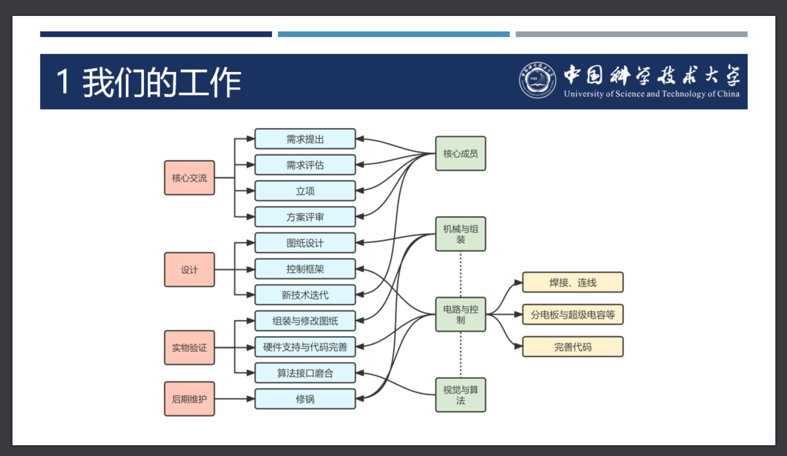
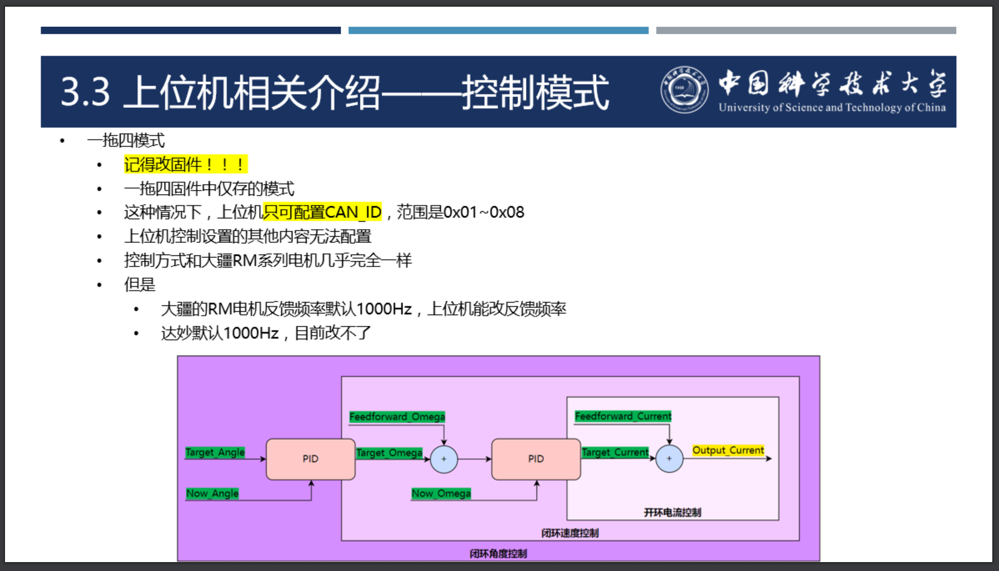
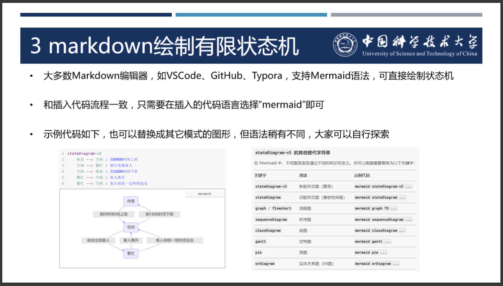
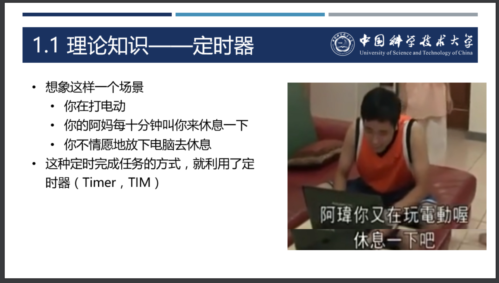

# 教程文档

## 0 主要功能与实际效果

本项用于电控教学, 内含若干大小技术点, **可使得新起步的队伍快速上手电控, 也可使得研发与传承困难, 技术积淀较少的队伍少走一定的弯路**

## 1 教程概述

### 1.1 教程整体构成

>   配套教学视频
>
>   https://space.bilibili.com/337732684/channel/collectiondetail?sid=1043942
>
>   环境配置安装包
>
>   http://home.ustc.edu.cn/~yssickjgd
>
>   配套代码与其他相关资料 ( 内容完全一致, 根据网络状况酌情下载. 由于Gitee平台有容量限制, 但本仓库容量较大, 因此该项目于202308242000转移至Github以及中国科大Linux用户协会校内Gitlab平台中. 原Gitee链接仍有效, 只是不保持更新 )
>
>   https://git.lug.ustc.edu.cn/yssickjgd/robowalker_train
>
>   https://github.com/yssickjgd/robowalker_train
>
>   配套PPT资料 ( 由于中国科大Rec网盘于20251201停止维护, 因此该项目于202506161600转移至中国科大新网盘科大云盘平台中. 原Rec网盘链接将失效 )  
>
>   https://pan.ustc.edu.cn/share/index/e7cdb46b48f44cdd8bff

### 1.2 教程目录

标黄为已更新内容

1.  电控 ( electrical )
    1.  ==电控简介 ( electrical_introduction )==
        1.  ==电控导论==
        2.  ==番外篇 如何去提问==
    2.  ==STM32CubeMX基础 ( stm32cubemx_basic )==
        1.  ==环境配置与基础教学==
        2.  ==GPIO输出电压==
        3.  ==EXTI外部中断==
        4.  ==TIM定时器中断==
            -   ==作业==
        5.  ==UART通信==
        6.  ==PWM呼吸灯==
        7.  ==ADC测电压==
    3.  ==电机控制 ( motor_control )==
        1.  ==C++==
            -   ==作业==
        2.  ==CAN通信==
        3.  ==CAN接口与大疆RM电机初步控制==
        4.  ==UART接口与串口绘图==
        5.  ==串口绘图接口与电机反馈==
        6.  ==PID算法==
        7.  ==PID接口与电机闭环控制==
        8.  ==电机接口与多环PID==
        9.  ==动态目标与前馈PID==
            - ==作业==
        10.  ==多电机控制==
        11.  ==番外篇 达妙电机控制==
        12.  ==番外篇 大疆电机进阶控制与相关库的累积更新==
    4.  ==开发工具篇 ( develop_tools )==
        1.  ==Markdown基础教学==
        2.  ==Git基础操作教学==
        3.  ==CLion开发环境配置==
        4.  ==gcc, Make与CMake==
        6.  ==番外篇 数学加速库arm_math.h的引入==
        6.  ==番外篇 开发相关的官方软件与官方文档获取==
        7.  ==番外篇 如何Debug==
    5.  ==底盘篇 ( chassis )==
        1.  ==DR16与DT7遥控器模块==
        3.  ==底盘概述==
        4.  ==底盘的运动学与动力学解算==
        4.  ==欧拉角与旋转矩阵==
        5.  ==力补偿适配方法==
        6.  ==功率控制前瞻==
        7.  ==电机功率模型==
        8.  ==功率控制策略==
        9.  ==算法层的斜坡规划器==
        10.  ==底盘小陀螺行进==
        11.  ==底盘跟随行进==
        12.  ==全向轮与麦轮适配算法==
        13.  ==舵轮适配算法==
        14.  ==操作逻辑==
        15.  ==驱动层的看门狗==
        16.  ==总结与致谢==
        17.  ==番外篇 无功率反馈的缓冲能量功率控制==
    6.  ==云台篇 ( gimbal )==
        1.  ==云台概述==
        2.  ==结合成品陀螺仪的云台控制==
        3.  ==角度开环控制==
        4.  ==操作逻辑==
        5.  ==控制信号设定与云台自稳机制==
        6.  ==阻力扭矩补偿、重力补偿与加速度补偿==
        7.  ==异构型云台的控制==
        8.  ==总结与致谢==
    7.  发射机构篇 ( booster )
        1.  ==发射机构概述==
        3.  ==算法层的有限状态机==
        3.  ==发射机构控制==
        4.  ==操作逻辑==
        5.  ==卡弹处理算法==
        6.  ==热量控制算法==
        7.  ==无裁判系统的热量检测算法==
        8.  ==总结与致谢==
    8.  裁判系统 ( referee )
        1.  裁判系统简介
        2.  裁判系统环境搭建
        3.  裁判系统用户协议解析
        4.  通信粘包处理
        5.  双缓冲UART通信
        6.  番外篇 CRC校验精讲
        7.  番外篇 计算机网络常识梳理
    9.  观测与滤波 ( filter )
        1.  概率论基础
        2.  矩阵分析基础
        3.  Kalman滤波器本篇
        4.  Kalman滤波器优化电机反馈速度
        5.  卷积与系统论基础
        6.  频率的形象化理解
        7.  频选滤波器
        8.  频选滤波器优化陀螺仪角速度
        9.  Kalman滤波器与频率滤波器的对比
        10.  番外篇 锁相环
    10.  陀螺仪 ( gyroscope )
         1.  陀螺仪概述
         2.  驱动接口层的SPI通信
         3.  SPI接口与陀螺仪读写
         4.  欧拉角与四元数
         5.  六轴陀螺仪姿态解算
         6.  陀螺仪适配算法
         7.  番外篇 云台共振探究
    11.  超级电容 ( supercap )
         1. 超级电容概述
         2. 超级电容控制理论
         3. 超级电容开源电路板
         4. 超级电容开源代码
2.  电控与硬件组 ( hardware )
    1.  硬件组工作内容
    2.  常见线材接口简介
    3.  常见电路元件简介
    4.  嘉立创EDA基本操作教学
    5.  STM32最小系统板
3.  电控与机械组 ( mechanical )
    1.  机械组工作内容
    2.  Solidworks建模基本方法
    3.  Solidworks导出加工图
    4.  常见的设计技巧
    5.  常见的加工工艺
4.  电控与视觉算法组 ( algorithm )
    1.  视觉算法组工作内容
    3.  自瞄基本策略
    5.  驱动接口层的USB虚拟串口
5.  宣传运营相关内容 ( operation )
    1.  从零开始建立一个战队
    6.  平面设计之Ps与Ai
    7.  视频剪辑之Pr
    8.  直播推流

### 1.3 教程开发环境

本教程内含两套开发环境, 且**均有完整的环境配置教学视频**, 详情可查找目录

- Keil环境
  - 该环境较为简单, 初学者易于上手
  - 环境配置教学位于目录中 **[1\_电控]->[2\_STM32CubeMX基础]->[1\_环境配置与基础教学]** 部分
  - 第二, 三章节, 即STMCubeMX基础章节与电机控制章节, 此部分内容较为基础, 因此基于该环境进行开发
- CLion环境
  - 该环境需要开发者手动配置内容较多, 如若想完全理解配置过程, 则需C语言以及ARM开发基础. 与此同时, 该开发环境功能更加优越, 相比Keil, 其代码提示更加智能, 且多线程编译使得编译速度大大加快
  - 环境配置章节位于目录中 **[1\_电控]->[4\_开发工具篇]->[3\_CLion开发环境配置]** 部分
  - 第四章节及后续上手对整个步兵机器人进行开发时, 本教程将主要采用该环境进行开发

### 1.4 教程特色

教程内含海量图片, 如流程图, 电路图, 用户手册重要部分的截图等内容进行辅助讲解. 与此同时, 教程也会细致介绍每个技术细节的工程原理, 通过工程师的"测试->思考->迭代"思维进行教学与思维训练

- **照顾新手**. 本教程仅需C语言基础即可上手, 其它任何所需的前置知识均有所提及
  - 如电机控制部分, 将会引入C++相关内容
  - 在底盘篇及其后续内容, 将会频繁用到Markdown笔记, 因此本人也对Markdown进行了细致讲解
  - 在引入新的开发环境后, 由于大多数学校的C语言并未细致讲解gcc以及相关编译知识, 因此本人对编译的原理进行了相应的讲解
  - 在底盘篇及其后续内容中, 由于频繁涉及了坐标系转换, 但考虑到RM电控同学可能未学过机器人学等相关内容, 且数学基础也仅限于一般的线性代数基础, 因此本人对欧拉角与旋转矩阵等概念也进行了细致讲解

- **理论实践相结合, 穷究原理洞悉本质**. 这也是我校校训"理实交融"的印证. 本教程每个工程实践部分, 均有前置背景知识的回顾与铺垫, 以及理论讲解作为引导, 且尽量避免硬调参, 盲调参的现象, 尽可能通过建模来进行更好的控制

  - 如单片机教学部分, 本人会在每一小节进行讲解该外设的实现原理, 而后才会进行嵌入式实验
  - 如电机控制部分, 本人从CAN通信原理开始讲起, 接下来是PID算法教学, 而后才进行对开环控制, 角速度闭环控制, 角度环双环闭环控制, 前馈控制等相关内容逐步讲解, 环环相扣
  - 如底盘控制部分, 本人带电控同学们了解了旋转矩阵的相关原理, 还在功率控制部分温习了泰勒展开的相关知识, 切实做到了理论指导实践

- **测试, 思考, 迭代的三个过程环环相扣, 充分体现了工程师思维**. 通过各种测试发现问题, 引入解决方案. 下举一小部分示例说明

  - 如底盘篇
    - 从小陀螺行进走偏引入底盘小陀螺角速度前馈等
  - 如云台篇
    - 从云台电机响应差的现象分析, 得出云台角速度反馈精度低的结论, 从而通过利用陀螺仪反馈云台角速度来解决该问题
    - 从云台会随底盘小陀螺以及上下坡运动, 操作手体验不佳的测试现象分析, 从而引出了云台自稳的概念

- **由浅入深, 循序渐进, 不止基础, 引人入胜**. 本教程虽然面向新队员, 但与此同时也不乏高技术含量与新颖的内容. 这些内容也无不透露着RM"穷究原理洞悉本质"的口号

  - 如底盘篇的功率控制算法, 本人从轮速闭环搭配限流的传统底盘控制与功率控制算法出发, 经测试发现其功率利用率低，通过一系列的分析，从而引出了力控底盘, 底盘的动力学解算以及电机建模与功率闭环控制等相关概念, 且在RMUL2025山东站青工会分享以及各大群聊中, 引起了一众RMer的讨论与交流
  - 如云台控制部分, 本人分析了传统双轴云台的运动学特征, 并在此基础上完善了三轴云台的控制策略. 本人也对双枪云台的干涉问题进行了一定的分析与讲解. 与此同时, 我队的薛佳龙同学, 针对本人双轴云台控制算法有待完善的部分提出了双稳云台的概念, 将传统云台相对于底盘坐标系控制转为大地坐标系下, 将云台的Yaw和Pitch解耦, 大幅提升了自瞄系统的云台跟随性能

- **图文并茂**. 对必要部分进行电路图, 流程图, 框架展示说明等内容的展示

  - 本图片摘自 **[1\_电控]->[1\_电控简介]->[1\_电控导论]** 部分

    

  - 本图片摘自 **[1\_电控]->[3\_电机控制篇]->[12\_达妙电机控制]** 部分

    

  - 本图片摘自 **[1\_电控]->[7\_发射机构篇]->[2\_算法层的有限状态机]** 部分

    

- **幽默风趣**. 内含适当的网络梗, 可在教学过程中起到活跃气氛的作用

  - 本图片摘自 **[1\_电控]->[2\_STM32CubeMX基础]->[4\_TIM定时器中断]** 部分

    

### 1.5 未来优化方向

一方面, 本人将持续沿续目录的顺序进行产出. 与此同时, 也将对粉丝们提出的需求以"番外篇"形式进行补充, 如达妙电机控制, Debug方法教学等

## 2. 开源声明

本开源遵循CC BY-NC ( Creative Commons Attribution-NonCommercial ) 开源协议, 仅限于RoboMaster参赛队之间队内交流使用，最终解释权为中国科学技术大学RoboWalker战队麻治昊所有

## 3 致谢与参考

1. 感谢 **中国科学技术大学 RoboWalker战队** 一路走来的伙伴们, 感谢**中国科学技术大学学生Linux用户协会**提供的代码托管平台支持!

2. 特别鸣谢 **哈尔滨工业大学 ( 威海 ) HERO战队 李赫** 同学, **防灾科技学院 思玄战队 赵子淇** 同学 对本系列电控教程的批评与指导

3. 最后, 附上各大高校的相关开源项目. 我们的Star与Fork便是最大的关注支持与谢意! ( 按参考时间排序 )

- **华南理工大学 华南虎战队** 电控开源SRML库
  - https://github.com/scutrobotlab/RM2021_Hero/tree/master/Chassis/SRML
- **吉林大学 TARS_Go战队** 电控开源架构
  - https://gitee.com/tarsgo-embedded/UIML
- **防灾科技学院 思玄战队** 超级电容功率控制算法
  - https://bbs.robomaster.com/forum.php?mod=viewthread&tid=22101
- **湖南大学 跃鹿战队** 电控开源架构
  - https://gitee.com/hnuyuelurm/basic_framework
- **青岛大学 XRobot战队** 电控开源架构
  - https://github.com/xrobot-org/XRobot
- **哈尔滨工程大学 创梦之翼战队** 遥控接收系统使用与维护手册
- **北部湾大学 飞虎战队** DT7的简易修理和校准
- **哈工大威海 HERO战队 李赫同学** 机器人学相关的坐标系旋转内容
  - https://zhuanlan.zhihu.com/p/13950686102
- **西交利物浦大学 GMaster战队** 电机功率模型
  - https://github.com/MaxwellDemonLin/Motor-modeling-and-power-control
- **香港科技大学 ENTERPRIZE战队** 功率控制算法
  - https://github.com/hkustenterprize/RM2024-PowerModule 

## 加油!

